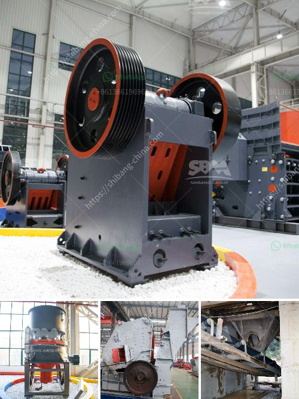

<h3>portable crusher in malaysia</h3>
Malaysia has a small coal mining sector operating from Bintulu, Merit-Pila, Silantek, and Tutoh in the state of Sarawak. Pulau Pinang,  Penang Island, and Kuala Lumpur are for housing and commercial industries, which are mainly small-scale industries, locally known as SMI (Small and Medium Industries). The Malaysian palm oil industry, the second-largest in the world after Indonesia, is an important sector of the country's economy. This sector produces crude palm oil (CPO), palm kernel oil (PKO), and palm kernel cake (PKC). It is estimated that over 80% of the palm oil mills in Malaysia use portable crushers to extract oil.

Portable crushers are also used in the mining and quarrying industries, especially for those valuable minerals, such as gold ore, limestone, granite, and iron ore. A portable crusher in the ore quarry plant can reduce material handling costs by obtaining materials directly from the field. This eliminates the need for a separate conveying system, saving time, and transportation costs.

Portable crushers consist of a large feed opening, a hybrid rotor system, and easily adjustable impact curtains for multiple crushing configurations. They have a compact design and are ideal for fast track construction projects and emergency construction sites. However, they can also be cheaper than stationary crushers. They have high production capacity, low energy consumption, and are environmentally friendly.

In Malaysia, portable crushers are used to crush rocks and stones through an efficient and environmentally friendly process. For example, portable limestone crusher, portable granite crusher, portable basalt crusher, portable dolomite crusher, etc. are available now. The supplies of these high-quality mineral ores will provide countless construction and industry achievements.

Portable crushers are versatile and can be mounted on wheels or track to increase mobility and reduce transportation costs. This flexibility also gives operators better control over the materials they are making. In many cases, a portable crusher can transform waste into reusable materials, reducing landfill waste and the need for new materials. By recycling materials, the mining industry can contribute to a more sustainable future.

Another advantage of portable crushers in Malaysia is that they can be used as part of a project's complete crushing and screening system. This enables multiple crushers to be put in place to achieve desired output materials. Portable crushers can be fed by loaders or excavators, depending on the application. They can also be equipped with vibrating feeders, screens, and conveyors to optimize the production process.

Overall, portable crushers have become an essential tool in the construction and mining industries in Malaysia. They offer numerous advantages, including cost savings, mobility, and environmental sustainability. With the increasing demand for minerals and construction materials, portable crushers play a crucial role in meeting these demands efficiently and effectively. As Malaysia continues its economic development, the demand for portable crushers is expected to rise, further driving the growth of the industry.
<h3>Contact us</h3><ul><li><strong>Whatsapp:&nbsp;<a href="https://wa.me/8613661969651">+8613661969651</a></strong></li><li><a href="https://swt.shibang-china.com/?git&amp;zhl&amp;portable crusher in malaysia"><strong>Online Service(chat now)</strong></a></li></ul><h3>Related</h3><ul><li><a href='cost setting up limestone mine.md'>cost setting up limestone mine</a></li><li><a href='coal powder making process.md'>coal powder making process</a></li><li><a href='used gold ore processing equipment for sale.md'>used gold ore processing equipment for sale</a></li><li><a href='south africa ballast crushing companies.md'>south africa ballast crushing companies</a></li><li><a href='what is the hammer mill.md'>what is the hammer mill</a></li></ul>