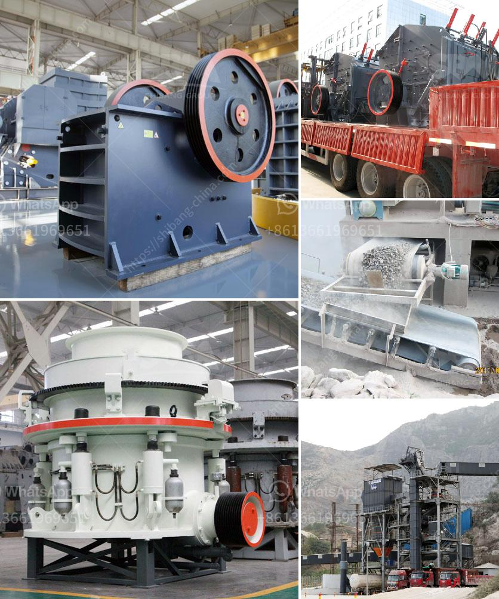

<h3>portable crusher in philippines</h3>
The Philippines is a country rich in mineral resources. The growth of its mining industry is flourishing, and the country has many portable crushing equipment manufacturers, suppliers, and contractors, contributing to the economic development of the Philippines.

Portable crushers can process various ores and minerals, including granite, limestone, quartz stone, river pebble, iron ore, copper ore, manganese ore, coal gangue, non-ferrous metal ore, pebbles, etc. These ores have different properties and uses, therefore, portable crushers can be built according to the customers' requirements on raw materials, capacity, and finished product specifications.

One of the portable crushers used in the Philippines is the multi-functional portable crusher, which has been used in mining machinery industry. It is a kind of stone crusher which can move on tire, which makes it portable and flexible. This portable crusher can be used for secondary crushing, tertiary crushing, and sand making.

The maximum feeding particle size of this equipment is up to 480mm, and the output particle size can be adjusted according to the needs of customers. The equipment is equipped with a vibrating screen and a conveyor belt, which can complete crushing, screening, and transportation of materials in one machine, greatly reducing the transportation cost of materials.

In addition to the multi-functional portable crusher, there are also various types of portable crushers, such as jaw crushers, cone crushers, impact crushers, and hammer crushers. These crushers can be used not only in the mining industry, but also in construction, chemical, metallurgy, and other industries.

The portable crushers in the Philippines come in different sizes and capacities. They are suitable for small-scale to large-scale crushing and screening operations, and they can meet the requirements of different projects of various scales.

Portable crushers have the advantages of large output, low noise, and low energy consumption. They are widely used in basalt crushing, limestone crushing, river pebble crushing, iron ore crushing, granite crushing and other industries. In the future, portable crushers will gradually replace traditional stationary crusher machines in the Philippines.

The Philippines has a higher demand for portable crushing equipment, and the process of building a portable crusher plant is not complicated. The country's mineral reserves will increase the number of portable crushers in the Philippines and improve their competitiveness in the international market.

With the development of the Philippines economy, more and more industries are being built, and the demand for portable crushers is increasing. Under such circumstances, the Philippines portable crusher market is expected to grow by 15-20% annually from 2020 to 2026.

In conclusion, the portable crusher made in the Philippines has a wide range of uses and high utilization rate in mining, construction, and other industries. However, due to its flexibility, portable crushers are still in the early stage of development. Investing in the portable crusher industry in the Philippines will bring new opportunities for investors.
<h3>Contact us</h3><ul><li><strong>Whatsapp:&nbsp;<a href="https://wa.me/8613661969651">+8613661969651</a></strong></li><li><a href="https://swt.shibang-china.com/?git&amp;zhl&amp;portable crusher in philippines"><strong>Online Service(chat now)</strong></a></li></ul><h3>Related</h3><ul><li><a href='carbonate crusher price per ton.md'>carbonate crusher price per ton</a></li><li><a href='process of a granite crusher machine.md'>process of a granite crusher machine</a></li><li><a href='mobile granite crusher.md'>mobile granite crusher</a></li><li><a href='vertical ball mill with price.md'>vertical ball mill with price</a></li><li><a href='crusher manufacturers in india.md'>crusher manufacturers in india</a></li></ul>