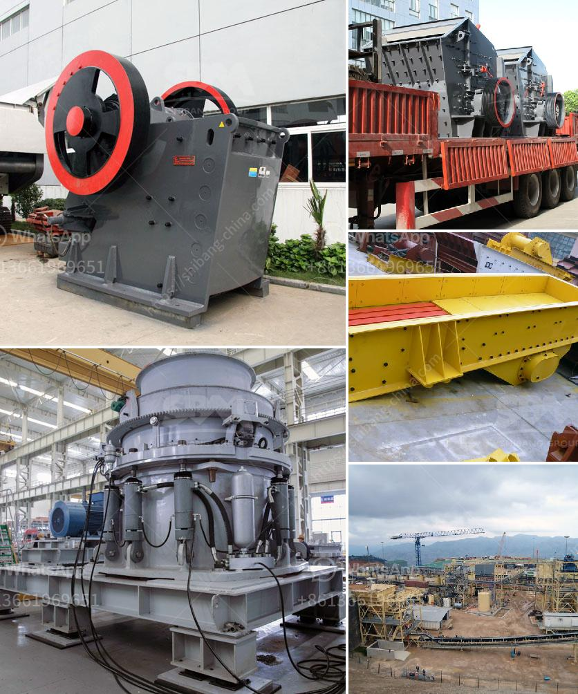

<h3>portable crushers for rent</h3>
Crushing is an essential process in many industries, whether it is mining, construction, road building, or recycling. However, depending on the nature of the project, renting a crusher may be more cost-effective than purchasing one. For projects that require a short-term commitment or have limited access to capital, portable crushers for rent offer a flexible and convenient solution. In this article, we will explore the benefits of portable crushers for rent and highlight their potential applications.

Portability is one of the main advantages of renting a crusher. Unlike stationary units, portable crushers can be easily transported to various job sites, allowing for greater flexibility. Whether you need to crush material at a demolition site or process aggregates at a quarry, portable crushers can adapt to your needs, reducing downtime and increasing overall productivity.

Another advantage of portable crushers for rent is that they are usually equipped with various features that enhance efficiency and ease of use. Modern portable crushers are equipped with advanced technologies such as remote control systems, intelligent operating panels, and automated setting adjustments, which simplify operation and increase safety. This eliminates the need for skilled operators and reduces the risk of accidents or errors during the crushing process.

Renting a portable crusher also removes the need for expensive upfront investment. Instead of purchasing a new crusher outright, you can rent one for the duration of your project, saving you both money and storage space. Additionally, renting allows you to access the latest models and technologies without the burden of ownership. This is particularly beneficial for smaller businesses or contractors who want to stay updated with the latest equipment but may not have the financial means to purchase new machinery.

The versatility of portable crushers makes them suitable for a wide range of applications. They can be used to crush various materials such as concrete, rock, asphalt, and demolition waste. This makes them ideal for tasks such as site clearing, concrete recycling, and aggregate production. Whether you are working on a large-scale construction project or tackling a small residential renovation, portable crushers can handle the job efficiently.

While portable crushers offer numerous benefits, it is essential to consider certain factors before deciding to rent one. Firstly, evaluate the size and nature of your project to determine the appropriate crusher size and capacity. Secondly, consider the availability of power sources and any logistical challenges associated with transporting and operating the crusher on-site.

In conclusion, portable crushers for rent offer a flexible and cost-effective solution for crushing applications. Their portability, advanced features, and ease of operation make them an attractive option for various industries. By renting a crusher, you can save on upfront investment, access the latest technology, and increase productivity. If you have a short-term project or limited capital, renting a portable crusher might be the right choice for you.
<h3>Contact us</h3><ul><li><strong>Whatsapp:&nbsp;<a href="https://wa.me/8613661969651">+8613661969651</a></strong></li><li><a href="https://swt.shibang-china.com/?git&amp;zhl&amp;portable crushers for rent"><strong>Online Service(chat now)</strong></a></li></ul><h3>Related</h3><ul><li><a href='marble primary crusher manufacturer.md'>marble primary crusher manufacturer</a></li><li><a href='conveyor systems for sand and gravel.md'>conveyor systems for sand and gravel</a></li><li><a href='maize grinding mill in philippines south africa.md'>maize grinding mill in philippines south africa</a></li><li><a href='limestone crusher plant price in india.md'>limestone crusher plant price in india</a></li><li><a href='how to separate gold from sand with machine.md'>how to separate gold from sand with machine</a></li></ul>