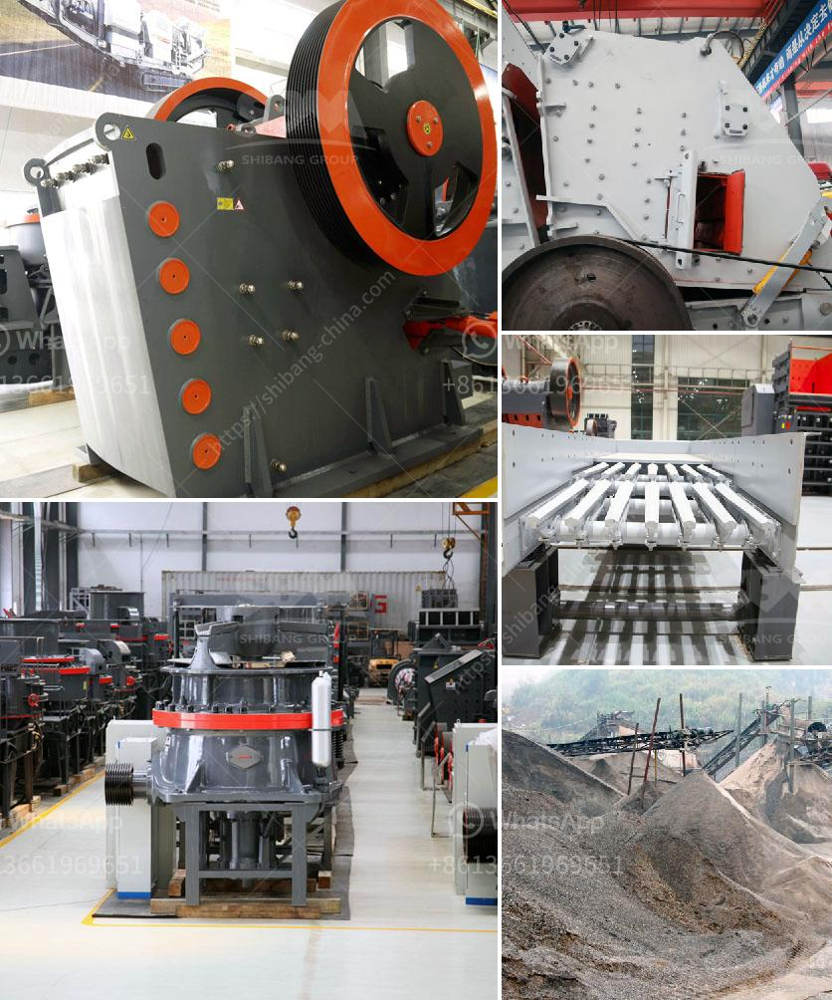

<h3>portable diamond processing plant supplier</h3>
The diamond industry is one of the most lucrative sectors in the world, with the demand for diamonds continuing to soar each year. As such, there is a constant need for more efficient and advanced diamond processing plants to keep up with the ever-growing demand. This is where portable diamond processing plant suppliers come into play, revolutionizing the industry and providing innovative solutions.

A portable diamond processing plant is a compact, mobile unit that is specifically designed for diamond mining operations. It is capable of processing large amounts of diamond-bearing ore while ensuring high recovery rates, minimizing wastage, and reducing the overall cost of diamond production. These plants are typically equipped with state-of-the-art technology and machinery that maximize efficiency and productivity.

One of the leading suppliers of portable diamond processing plants is XYZ Diamond Machinery. With years of experience and expertise in the field, they have developed cutting-edge plants that are revolutionizing the diamond mining industry. Their portable plants are designed to be easily transported and set up in remote locations, enabling diamond miners to access previously untapped sources.

One of the key advantages of portable diamond processing plants is their mobility. Traditional diamond processing plants are fixed, requiring extensive infrastructure and logistics to transport the ore to the processing site. In contrast, portable plants can be taken directly to the source, minimizing the need for transportation and reducing the overall cost of diamond production. This mobility also allows miners to process the ore on-site, eliminating the need to transport large quantities of material, thereby saving time and resources.

In addition to mobility, portable diamond processing plants offer a range of features that maximize efficiency and recovery rates. These plants are equipped with advanced sorting and recovery systems that can separate diamonds from other materials with unparalleled precision. Furthermore, they are designed to have a small footprint, minimizing the environmental impact and making them suitable for environmentally sensitive areas.

The portable diamond processing plants from XYZ Diamond Machinery are also highly customizable. They can be tailored to specific mining conditions and requirements, ensuring that each plant is optimized for maximum performance. This customization allows miners to achieve higher recovery rates, reduce operational costs, and increase productivity.

The advent of portable diamond processing plants has truly revolutionized the diamond mining industry. Miners now have access to efficient, cost-effective, and environmentally-friendly processing solutions that were once unimaginable. These plants provide a practical and sustainable alternative to traditional fixed processing plants, enabling mining operations in remote locations and maximizing the value of diamond-bearing ore.

In conclusion, portable diamond processing plant suppliers such as XYZ Diamond Machinery are playing a crucial role in revolutionizing the diamond industry. Their innovative and efficient plants are changing the way diamonds are mined and processed, offering miners a range of benefits including mobility, high recovery rates, and customization options. As the demand for diamonds continues to grow, portable diamond processing plants will undoubtedly play an even more significant role in meeting the industry's needs and ensuring a sustainable and profitable future for diamond mining.
<h3>Contact us</h3><ul><li><strong>Whatsapp:&nbsp;<a href="https://wa.me/8613661969651">+8613661969651</a></strong></li><li><a href="https://swt.shibang-china.com/?git&amp;zhl&amp;portable diamond processing plant supplier"><strong>Online Service(chat now)</strong></a></li></ul><h3>Related</h3><ul><li><a href='nigeria granite crushers.md'>nigeria granite crushers</a></li><li><a href='roller for plate mill manufacturer.md'>roller for plate mill manufacturer</a></li><li><a href='price for rock crusher.md'>price for rock crusher</a></li><li><a href='stone crusher in subic.md'>stone crusher in subic</a></li><li><a href='hydroton pebbles clay manufacturing process.md'>hydroton pebbles clay manufacturing process</a></li></ul>