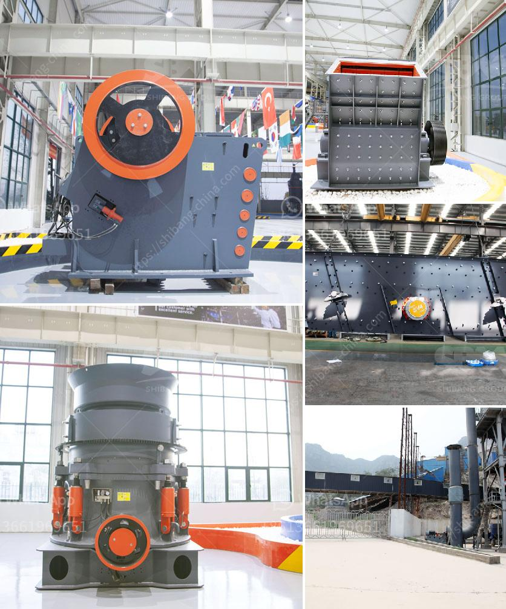

<h3>portable hammer mill for gold ore</h3>
A portable hammer mill for gold ore is an incredible tool when it comes to breaking down large rocks into smaller pieces. These mills are powerful, efficient, and can be transported easily, making them perfect for use in remote areas. The portable hammer mill is also ideal for prospectors or hobbyists who want to process their own ore and tailings to get a better understanding of their mineral content.

One key benefit of a portable hammer mill is that it can be easily moved from one location to another, whether that's within a mine or to a different mining site altogether. This makes it a versatile tool that can be used in a variety of mining operations, regardless of how remote or difficult to access they may be.

The primary purpose of a portable hammer mill is to break down ore into fine particles, which can then be processed further using other equipment. By reducing the size of the ore, these mills increase the surface area, making it easier for the gold to be extracted through various methods such as cyanide leaching or gravity concentration.

In addition to its portability, a portable hammer mill for gold ore is also equipped with heavy-duty hammers that crush the ore quickly and effectively. These hammers can reduce rocks to fine particles in a matter of seconds, ensuring that the ore is processed efficiently and without unnecessary delays.

Furthermore, a portable hammer mill for gold ore can be powered either by electricity or by diesel engines, which makes it a versatile choice for those who prefer different power sources. With its compact design and high performance, a portable hammer mill can bring the benefits of efficiency and convenience to any mining operation.

In conclusion, a portable hammer mill for gold ore is a powerful tool that is not only a valuable addition to the mining industry but also enhances the overall quality and reduces the cost of ore extraction. The compact design and efficiency of these portable mills allow them to be easily transported and operated in remote locations, making them an ideal choice for any aspiring prospector or small-scale miner.
<h3>Contact us</h3><ul><li><strong>Whatsapp:&nbsp;<a href="https://wa.me/8613661969651">+8613661969651</a></strong></li><li><a href="https://swt.shibang-china.com/?git&amp;zhl&amp;portable hammer mill for gold ore"><strong>Online Service(chat now)</strong></a></li></ul><h3>Related</h3><ul><li><a href='rock crushers for making gravel.md'>rock crushers for making gravel</a></li><li><a href='stone crusher in mexico.md'>stone crusher in mexico</a></li><li><a href='biggest jaw crusher in the world.md'>biggest jaw crusher in the world</a></li><li><a href='crushed stone products mwanza tanzania.md'>crushed stone products mwanza tanzania</a></li><li><a href='iron ore beneficiation.md'>iron ore beneficiation</a></li></ul>