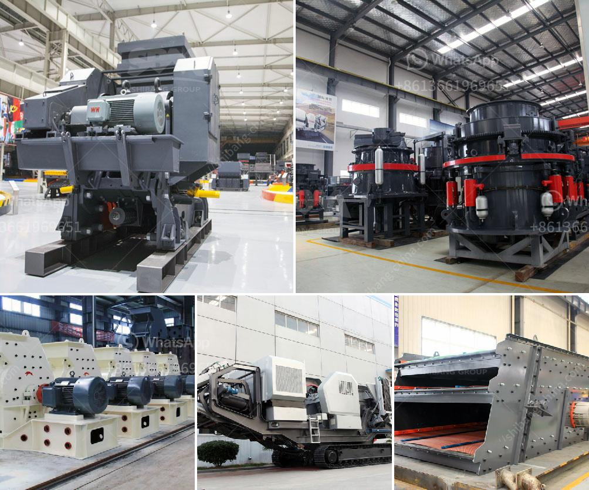

<h3>portable limestone crushing systems</h3>
Portable limestone crushing systems are designed to meet the different needs of customers. The portable limestone crushing system consists of a primary crushing unit and a secondary crushing unit. The primary crusher is a crawler-mounted plant equipped with a vibrating grizzly feeder and a jaw crusher, and the secondary crusher is a crawler-mounted plant equipped with a vibrating screen and a cone crusher.

The portable limestone crushing systems have a range of heavy-duty features including a uniquely designed hopper, mobile frame and chassis, hydraulic leveling, double deck vibrating screen, adjustable crusher throw and high motor power. The portable limestone crushing system is equipped with a high-quality jaw crusher or impact crusher, with low wear and fuel consumption.

Portable limestone crushing systems ensure transportation flexibility. With the flexibility to relocate, the system easily moves between construction sites, ensuring that crushing is always taking place close to the material source. This significantly reduces trucking costs and environmental impact.

The portable limestone crushing system also allows for flexibility and control over the final product size. The system includes an integrated screen module that allows the fines to be bypassed. This enables the operator to have optimal control over the end product size, resulting in a high-quality, consistent product.

Furthermore, the portable limestone crushing system has a robust construction for a long lifespan and durability under tough conditions. It is highly reliable and requires minimal maintenance, reducing downtime and increasing productivity.

In conclusion, portable limestone crushing systems are a great investment for any construction company or quarry business. They offer flexibility, control, and convenience, ensuring that crushing operations are done efficiently and effectively. With their heavy-duty features and high-quality construction, these systems are built to last, providing a reliable and long-lasting solution for limestone crushing.
<h3>Contact us</h3><ul><li><strong>Whatsapp:&nbsp;<a href="https://wa.me/8613661969651">+8613661969651</a></strong></li><li><a href="https://swt.shibang-china.com/?git&amp;zhl&amp;portable limestone crushing systems"><strong>Online Service(chat now)</strong></a></li></ul><h3>Related</h3><ul><li><a href='copper crusher suppliers in zambia.md'>copper crusher suppliers in zambia</a></li><li><a href='jaw crusher equipment alibaba.md'>jaw crusher equipment alibaba</a></li><li><a href='limestone beneficiation.md'>limestone beneficiation</a></li><li><a href='cone crushers south africa.md'>cone crushers south africa</a></li><li><a href='mini cement plant project report india.md'>mini cement plant project report india</a></li></ul>