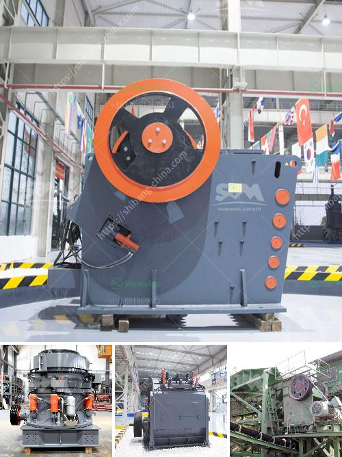

<h3>portable silica sand washing machine</h3>
The demand for high-quality silica sand has been increasing rapidly in recent years, due to its wide range of applications in various industries such as glass manufacturing, construction, and foundry. As a result, the need for efficient and portable silica sand washing machines is on the rise.

Silica sand washing machines are designed to remove dirt, impurities, and clay from silica sand, ensuring its purity and improving its quality. In today's construction industry, portable washing machines have gained popularity due to their ease of use, portability, and convenience.

One such portable silica sand washing machine is the XSD series sand washer, which is extensively used in various industrial sectors. This machine is equipped with advanced technology, making it an ideal choice for washing sand in a efficient and hassle-free manner.

The portable silica sand washing machine mainly consists of a hopper, vibrating feeder, jaw crusher, sand making machine, vibrating screen, belt conveyor, and electric control panel. The power system of this machine is composed of a motor, belt pulley, triangular belt, and reducer. The portable sand washer is driven by the motor, which drives the impeller to rotate and continuously move the sand and water mixture in the washing tank.

The washing tank in the portable silica sand washing machine contains a desander and a sand recovery system, which can effectively clean and recover sand particles lost during the washing process. This ensures minimal wastage of resources and helps maintain a sustainable approach towards sand washing.

The portable design of this machine allows for easy transportation and installation at various worksites, making it a versatile option for multiple applications. Whether it is used for washing sand in a quarry or cleaning sand on a construction site, this portable silica sand washing machine can deliver impeccable results.

The benefits of using a portable silica sand washing machine are numerous. Firstly, it helps in reducing the dependency on traditional sand washing methods, which often involve manual labor and consume a significant amount of time and resources. Additionally, the machine's efficient water and sand recovery system ensures minimal water usage and wastage, promoting sustainability.

Furthermore, the portable silica sand washing machine can be easily operated and maintained. Its user-friendly interface and clear operating instructions make it suitable for both skilled professionals and first-time users. The machine's robust construction and durable components ensure a long operational life, even in harsh working conditions.

In conclusion, the demand for high-quality silica sand is increasing, necessitating the use of efficient and portable silica sand washing machines. The XSD series sand washer is a versatile and user-friendly option that can cater to various sand washing requirements. With its portable design, advanced technology, and sustainable approach, this machine is undoubtedly a valuable addition to any sand washing operation.
<h3>Contact us</h3><ul><li><strong>Whatsapp:&nbsp;<a href="https://wa.me/8613661969651">+8613661969651</a></strong></li><li><a href="https://swt.shibang-china.com/?git&amp;zhl&amp;portable silica sand washing machine"><strong>Online Service(chat now)</strong></a></li></ul><h3>Related</h3><ul><li><a href='mining equipment hire indonesia.md'>mining equipment hire indonesia</a></li><li><a href='business plan on how to start a small scale quarry plant.md'>business plan on how to start a small scale quarry plant</a></li><li><a href='cement clinker manufacturing plant.md'>cement clinker manufacturing plant</a></li><li><a href='stone crushing plant for sale in south africa.md'>stone crushing plant for sale in south africa</a></li><li><a href='hammer mill aluminum slag.md'>hammer mill aluminum slag</a></li></ul>