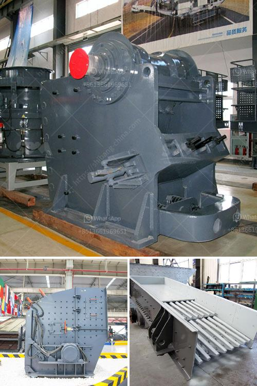

<h3>portalble stone crusher</h3>
The importance of having the right equipment for your construction project cannot be overstated. Portable stone crushers are specifically designed to meet the needs of small-scale quarries and construction projects. These machines are a valuable asset for your project as they are cost-effective and easy to use. With the ever-increasing demands of construction projects, the need for efficient and reliable crushing equipment has become paramount. This is where portable stone crushers come into play.

Portable stone crushers are designed to be highly efficient and user-friendly. Not only does this enable fast and convenient crushing of materials, but it also allows for easy transportation and relocation. The mobility of these machines allows operators to work in multiple locations, contributing to increased productivity and reduced downtime.

One of the advantages of choosing a portable stone crusher is its portability. Once set up at a job site, it can be moved between sites with ease. This eliminates the need for special transportation permits and reduces transportation costs. Additionally, the compact size of portable stone crushers makes them easy to maneuver in tight spaces, which is essential in construction projects with limited accessibility.

In terms of functionality, portable stone crushers are designed with a high crushing capacity. These machines offer an ideal solution for primary crushing applications involving hard, abrasive materials such as granite or recycled concrete. Efficient crushers ensure high productivity even with changing raw materials. This versatility, combined with their robust construction, makes portable stone crushers an excellent investment.

Another aspect that contributes to the value of portable stone crushers is their low operating costs. These machines consume less energy compared to traditional crushers, resulting in reduced fuel consumption and lower operational expenses. Additionally, portable stone crushers require minimal maintenance, helping to keep operating costs at a minimum. With their robust and durable construction, these crushers are built to withstand tough working conditions, leading to increased longevity.

Portable stone crushers also offer a greener alternative to traditional crushing methods. By reducing the amount of waste material and decreasing transportation emissions, these machines contribute to a more sustainable construction industry. Additionally, some portable stone crushers are equipped with advanced features such as dust suppression systems, further reducing their environmental impact.

In conclusion, portable stone crushers are a great investment for any construction project. They offer efficient crushing capabilities, easy transportation, and low operating costs. Their mobility allows them to be easily moved between sites, ensuring maximum productivity and minimum downtime. Moreover, their compact size and low energy consumption make them a sustainable and environmentally friendly choice. When considering your construction needs, a portable stone crusher should be at the top of your list.
<h3>Contact us</h3><ul><li><strong>Whatsapp:&nbsp;<a href="https://wa.me/8613661969651">+8613661969651</a></strong></li><li><a href="https://swt.shibang-china.com/?git&amp;zhl&amp;portalble stone crusher"><strong>Online Service(chat now)</strong></a></li></ul><h3>Related</h3><ul><li><a href='rock drills for sale in south africa.md'>rock drills for sale in south africa</a></li><li><a href='stone crushing machines in oman.md'>stone crushing machines in oman</a></li><li><a href='how much investment needed to start a crusher in canada.md'>how much investment needed to start a crusher in canada</a></li><li><a href='slag powder making.md'>slag powder making</a></li><li><a href='production of iron ore and manganese.md'>production of iron ore and manganese</a></li></ul>