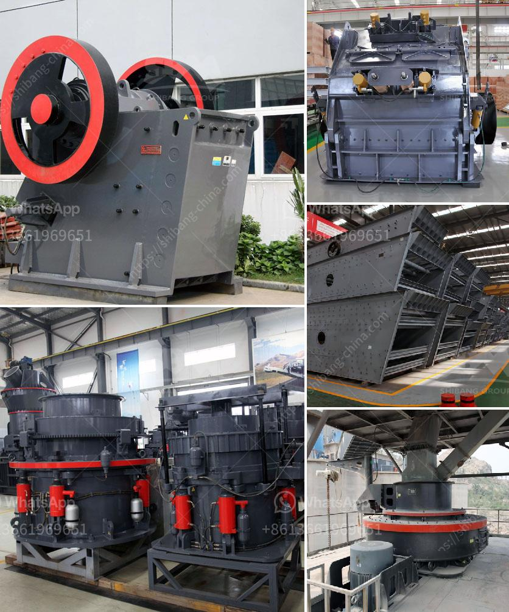

<h3>powder crushing machine making</h3>
In various industries, the process of grinding and crushing materials is essential. However, the traditional methods of crushing and grinding can be time-consuming, inefficient, and even hazardous. That's where powder crushing machines come into play. These machines enable businesses to finely grind various materials and convert them into powders, making them easier to handle, transport, and utilize.

Powder crushing machines are widely used across diverse industries such as food processing, pharmaceuticals, mining, chemical manufacturing, and many others. Their primary purpose is to reduce the size of large materials to achieve a finer or more uniform particle size distribution. This process enhances the efficiency of subsequent manufacturing or extraction processes that require materials in powdered form.

One of the key advantages of powder crushing machines is their ability to handle a wide range of materials. Whether it's grains, herbs, spices, minerals, or even plastics, these machines can crush and grind them to the desired consistency. The versatility of these machines makes them indispensable in many industries, where different materials might need to be crushed for diverse purposes.

Powder crushing machines can be categorized into various types, depending on their design and functionality. Some machines are designed to grind materials by forcing them between rotating abrasive surfaces, while others use sharp blades or hammers to shred and pulverize materials. The choice of machine largely depends on the specific requirements of each industry and the type of material being processed.

In addition to their varied designs, powder crushing machines also come in different sizes and capacities. Smaller machines may be suitable for laboratories and small-scale production, while larger machines are capable of handling high volumes of materials in industrial settings. Manufacturers often provide user-friendly controls and safety features to ensure optimum performance and protect operators from potential hazards.

The benefits of using powder crushing machines are numerous. Firstly, these machines significantly reduce the amount of manual labor required for grinding and crushing materials. This not only saves time and effort but also minimizes human error, ensuring greater accuracy in particle size reduction. Moreover, powder crushing machines are designed to operate at high speeds, resulting in efficient processing of materials, further enhancing productivity.

Furthermore, powder crushing machines offer more control over the final product's particle size distribution. By adjusting the machine's settings, operators can achieve the desired fineness for their specific application. This level of control is crucial in industries such as pharmaceuticals and chemical manufacturing, where the quality and consistency of the end product are of utmost importance.

As technology continues to advance, powder crushing machines are becoming more efficient, eco-friendly and versatile. Manufacturers are continuously developing innovative features to enhance their performance, such as automated feeding systems, self-cleaning mechanisms, and energy-saving options. These advancements not only improve the overall efficiency of the machines but also reduce operating costs and environmental impact.

In conclusion, powder crushing machines have revolutionized various industries by enabling the efficient and precise grinding and crushing of materials. With their ability to handle a wide range of materials and offer customizable particle size distribution, these machines have become indispensable for manufacturers across the globe. Their continuous development and improvement make them an essential tool for businesses seeking to optimize their production processes and enhance their overall productivity.
<h3>Contact us</h3><ul><li><strong>Whatsapp:&nbsp;<a href="https://wa.me/8613661969651">+8613661969651</a></strong></li><li><a href="https://swt.shibang-china.com/?git&amp;zhl&amp;powder crushing machine making"><strong>Online Service(chat now)</strong></a></li></ul><h3>Related</h3><ul><li><a href='sample business plan for stone crusher in bolivia.md'>sample business plan for stone crusher in bolivia</a></li><li><a href='marble factory production line.md'>marble factory production line</a></li><li><a href='hammer mill 25 ton hour.md'>hammer mill 25 ton hour</a></li><li><a href='used coal washing plants for sale in india.md'>used coal washing plants for sale in india</a></li><li><a href='used gold ore processing equipment for sale.md'>used gold ore processing equipment for sale</a></li></ul>