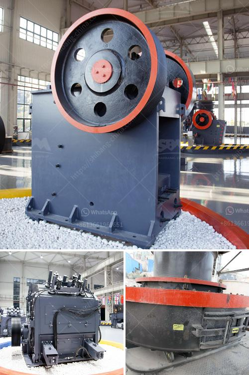

<h3>powder grinfing mill sale</h3>
Powder grinding mill sale is an exciting opportunity for those in the mining and material processing industry. These mills are used to grind various materials into fine powders, making them suitable for use in a range of industries, including construction, metallurgy, chemical engineering, and more.

The sale of powder grinding mills offers businesses the chance to upgrade their machinery or expand their operations. With advancements in technology, newer models are equipped with features that enhance efficiency and productivity. They are designed to handle a wide range of materials, from soft to hard, and can produce a specific particle size distribution.

One of the main advantages of a powder grinding mill is its ability to finely grind materials. By reducing the particle size, these mills increase the surface area, allowing for better mixing and absorption in subsequent processes. This makes them an essential tool for industries that depend on finely ground materials, such as the pharmaceutical and food industries.

Additionally, powder grinding mills are designed to operate with minimal energy consumption. They are equipped with efficient motors and specialized grinding mechanisms, which reduce the power required to produce the desired particle size. This not only reduces costs but also makes the mills more environmentally friendly.

During a powder grinding mill sale, businesses can expect competitive prices and a range of options to choose from. Different models and sizes are available to match specific production needs. Some mills may also come with additional features like automatic feeding and built-in dust collection systems.

Investing in a powder grinding mill can greatly benefit businesses by improving their production processes, reducing costs, and enhancing product quality. Whether it's upgrading existing machinery or expanding operations, a powder grinding mill sale provides an excellent opportunity to take advantage of advanced technology and achieve better results.

In conclusion, the powder grinding mill sale offers a range of benefits for businesses in various industries. With newer models offering enhanced efficiency and productivity, businesses can upgrade their machinery, expand operations, and improve overall production processes. With competitive prices and a range of options available, now is the perfect time to invest in a powder grinding mill.
<h3>Contact us</h3><ul><li><strong>Whatsapp:&nbsp;<a href="https://wa.me/8613661969651">+8613661969651</a></strong></li><li><a href="https://swt.shibang-china.com/?git&amp;zhl&amp;powder grinfing mill sale"><strong>Online Service(chat now)</strong></a></li></ul><h3>Related</h3><ul><li><a href='trommel ball mill.md'>trommel ball mill</a></li><li><a href='crusher manufacturers prices.md'>crusher manufacturers prices</a></li><li><a href='open cast mining equipment for sale south africa.md'>open cast mining equipment for sale south africa</a></li><li><a href='mobile coal screen units south africa.md'>mobile coal screen units south africa</a></li><li><a href='hammer mill gauteng.md'>hammer mill gauteng</a></li></ul>