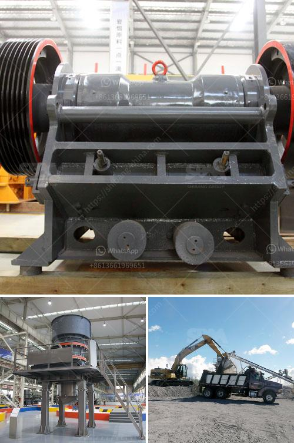

<h3>price crusher 30 ton</h3>
In today's increasingly urbanized world, construction and demolition waste management has become a pressing issue. The sheer volume of waste generated from these activities poses significant environmental challenges. As the global population continues to grow, the need for effective waste management solutions becomes ever more important.

Enter Price Crusher 30 Ton – a revolutionary machine designed to tackle the problem of crushing demolition waste efficiently and effectively. This powerful piece of equipment has the ability to crush a wide range of materials, from concrete to brick, stone, asphalt, and more. With its unique capabilities, it provides the perfect solution for companies looking to reduce waste and reuse materials.

One of the standout features of the Price Crusher 30 Ton is its impressive crushing capacity. Equipped with a robust jaw crusher, it can easily process large pieces of material, reducing them down to smaller, more manageable sizes. This not only saves time but also minimizes the need for manual labor and additional machinery.

The machine is designed with durability in mind, ensuring it can withstand the toughest of conditions. Its heavy-duty construction and quality components guarantee longevity, reducing the need for frequent repairs or replacements. This not only saves money in the long run but also ensures uninterrupted operation, maximizing productivity.

Another notable advantage of the Price Crusher 30 Ton is its versatility. It can be easily transported to different job sites, allowing for efficient waste management in various locations. Its compact size and user-friendly design make it ideal for both small-scale projects and larger operations.

Moreover, this versatile machine offers adjustable settings to tailor the final product's size. This flexibility is essential for companies working on different applications, enabling them to produce the desired crushed materials for specific purposes. Whether it be aggregates for road construction or recycled materials for concrete production, the Price Crusher 30 Ton can deliver the required output.

As the global push for sustainability increases, the Price Crusher 30 Ton plays a crucial role in reducing environmental impact. By crushing and reusing materials, it minimizes the need for extraction and production of new resources. This not only conserves natural resources but also reduces energy consumption and greenhouse gas emissions.

With the Price Crusher 30 Ton, companies can also save money by utilizing recycled materials instead of purchasing new ones. This cost-effective solution contributes to a greener and more cost-efficient approach to waste management. Additionally, recycling materials can help businesses meet sustainability targets and comply with regulations related to waste reduction.

To sum it up, the Price Crusher 30 Ton is a game-changer in the field of demolition waste management. Its powerful crushing capacity, durability, and versatility make it an indispensable tool for companies looking to reduce waste and promote sustainability. By investing in this innovative machine, businesses can not only save money but also contribute to a cleaner, greener future.
<h3>Contact us</h3><ul><li><strong>Whatsapp:&nbsp;<a href="https://wa.me/8613661969651">+8613661969651</a></strong></li><li><a href="https://swt.shibang-china.com/?git&amp;zhl&amp;price crusher 30 ton"><strong>Online Service(chat now)</strong></a></li></ul><h3>Related</h3><ul><li><a href='vibrating grizzly feeder 35 ton per jam.md'>vibrating grizzly feeder 35 ton per jam</a></li><li><a href='crushing plant turkey.md'>crushing plant turkey</a></li><li><a href='ballast crusher price.md'>ballast crusher price</a></li><li><a href='china roller mill kenya.md'>china roller mill kenya</a></li><li><a href='barite beneficiation.md'>barite beneficiation</a></li></ul>