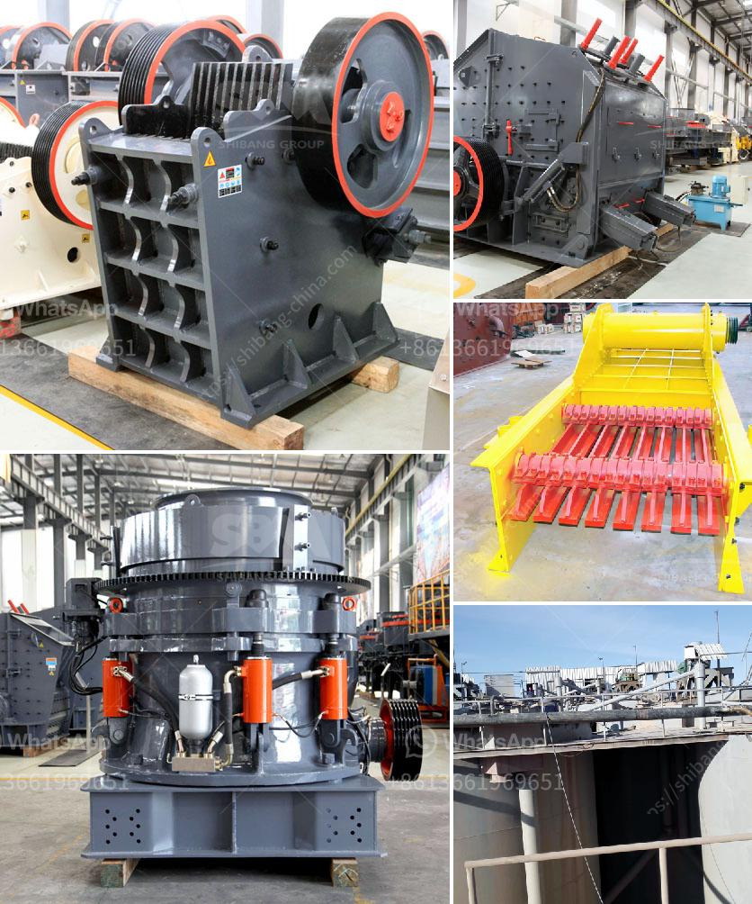

<h3>price for cone crusher</h3>
The cone crusher is a powerful crushing machine that is used in a variety of industries. It is highly efficient and offers reliable crushing performance. While the price of cone crushers can vary significantly depending on the manufacturer and model, they generally range from several thousand dollars to tens of thousands of dollars.

The price of a cone crusher is influenced by several factors, including the manufacturing process, quality, and the aftermarket support available. Overall, it is important to consider the value for money when purchasing a cone crusher.

One of the main factors affecting the price of a cone crusher is the manufacturing process. Crushers that are made using high-quality materials and advanced manufacturing techniques tend to be more expensive. However, they also offer better performance, longer lifespan, and require less maintenance. On the other hand, crushers manufactured using lower-quality materials may come at a lower price but may not deliver the desired results in terms of efficiency and durability.

Another important consideration when looking at the price of a cone crusher is the aftermarket support provided by the manufacturer. It is crucial to choose a manufacturer that offers comprehensive customer support, including technical assistance, spare parts availability, and service. While such support may come at an additional cost, it is essential for the smooth operation of the crusher and can save money in the long run.

Lastly, it is important to compare prices from different manufacturers and consider the specific needs of the application. Some cone crushers may be more suitable for certain industries or materials than others, which can affect their price. Additionally, considering the total cost of ownership, including energy consumption and maintenance expenses, is important to make an informed decision.

In conclusion, the price of a cone crusher can vary depending on various factors, including the manufacturing process, quality, and aftermarket support. It is crucial to consider these factors along with the specific requirements of the application to determine the best value for money. Taking the time to research and compare different options can lead to an optimal investment in a cone crusher that delivers high performance and reliability.
<h3>Contact us</h3><ul><li><strong>Whatsapp:&nbsp;<a href="https://wa.me/8613661969651">+8613661969651</a></strong></li><li><a href="https://swt.shibang-china.com/?git&amp;zhl&amp;price for cone crusher"><strong>Online Service(chat now)</strong></a></li></ul><h3>Related</h3><ul><li><a href='philippines crusher manufacturers in pakistan.md'>philippines crusher manufacturers in pakistan</a></li><li><a href='secondary jaw crusher.md'>secondary jaw crusher</a></li><li><a href='industrial impact crushers.md'>industrial impact crushers</a></li><li><a href='feasibility study for cocoa unit processing.md'>feasibility study for cocoa unit processing</a></li><li><a href='price of jaw crusher in zimbabwe.md'>price of jaw crusher in zimbabwe</a></li></ul>