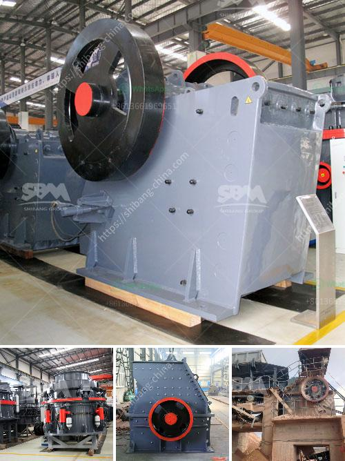

<h3>price for rock crusher</h3>
The rock crusher is a widely used machine in many industries, especially construction. These crushers are used for crushing large stones, rocks, metals, iron, etc., into small particles, which are used in various applications. These crushers are typically portable, heavy-duty machines that can handle various types of materials.

When considering the price of a rock crusher, there are several factors to take into account. The first and most important factor is the type of rock crusher you choose. There are different types of crushers available in the market, including jaw crushers, cone crushers, gyratory crushers, impact crushers, and more. Each type has its own unique features and advantages. The price of each type of crusher can vary significantly based on various factors such as the brand, features, capacity, and durability.

Another factor that affects the price of a rock crusher is the size of the machine. Crushers come in various sizes, ranging from small portable crushers that can be carried from one place to another, to large stationary crushers that are permanently installed. The size of the crusher required depends on the volume of material to be crushed and the desired output size.

The brand and reputation of the manufacturer also impact the price of the rock crusher. Well-known and reputable brands in the industry are often more expensive due to their established credibility and quality. However, it's important to note that sometimes lesser-known brands may offer similar features and quality at a lower price. It's advisable to research and compare different brands before making a purchase.

The capacity and production rate of the rock crusher also affect its price. A rock crusher with higher capacity can process more material, which may be suitable for larger-scale projects. However, it's important to balance the desired capacity with the available budget. It's not always necessary to choose the highest capacity crusher if it exceeds the requirements of your project.

Lastly, the condition of the used or refurbished rock crusher can impact its price. Used or refurbished crushers are often more affordable compared to brand new ones. However, it's critical to thoroughly inspect the condition of the used crusher and ensure that it is in good working order. Buying from a reputable dealer or conducting a thorough inspection before purchase will help avoid any potential issues or unexpected costs down the line.

In conclusion, the price of a rock crusher can vary based on various factors such as the type, size, brand, capacity, and condition. When purchasing a rock crusher, it's important to carefully consider these factors to ensure that you are getting the best value for your money. It's advisable to research different options, compare prices, and consult with experts if needed. With careful consideration, you can find a rock crusher that meets your specific requirements at a reasonable price.
<h3>Contact us</h3><ul><li><strong>Whatsapp:&nbsp;<a href="https://wa.me/8613661969651">+8613661969651</a></strong></li><li><a href="https://swt.shibang-china.com/?git&amp;zhl&amp;price for rock crusher"><strong>Online Service(chat now)</strong></a></li></ul><h3>Related</h3><ul><li><a href='komatsu crawler jaw crusher.md'>komatsu crawler jaw crusher</a></li><li><a href='crusher manufacturer in gujarat.md'>crusher manufacturer in gujarat</a></li><li><a href='movable crushing plant.md'>movable crushing plant</a></li><li><a href='hp ball mill motors.md'>hp ball mill motors</a></li><li><a href='crusher used for copper ore.md'>crusher used for copper ore</a></li></ul>