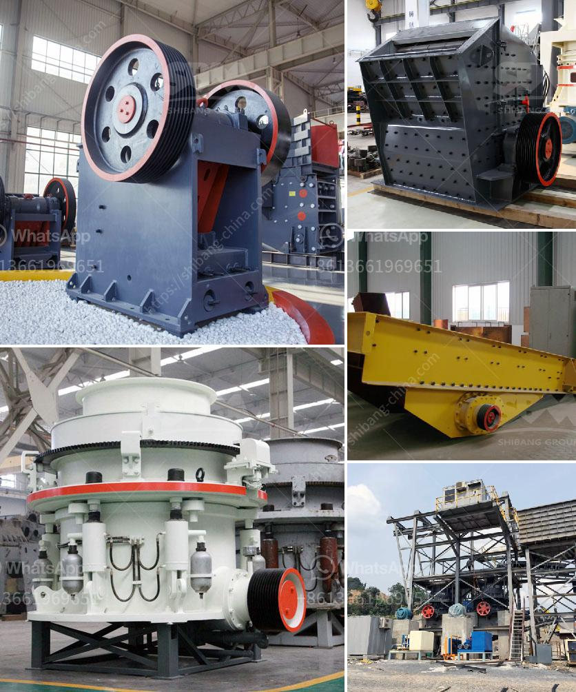

<h3>price list of sand manufacturing machine india</h3>
Sand manufacturing machines are widely used in construction projects and play a crucial role in producing high-quality sand for various applications. In India, there is a wide range of sand manufacturing machines available in the market. This article will provide you with a price list of sand manufacturing machines in India, helping you make an informed decision.

1. Jaw Crusher: A jaw crusher is a primary crusher used for crushing large rocks and stones into smaller sizes. This machine is commonly used in sand manufacturing plants to crush raw materials. The price of a jaw crusher in India starts from around INR 2 lakhs and can go up to INR 10 lakhs, depending on the size and capacity of the machine.

2. Cone Crusher: A cone crusher is a secondary crusher that is commonly used after the jaw crusher. It helps in producing finer and more uniform sand particles. The price of a cone crusher in India starts from around INR 5 lakhs and can go up to INR 20 lakhs, depending on the size and capacity of the machine.

3. Sand Making Machine (VSI Crusher): A sand making machine, also known as a VSI crusher, is used to produce artificial sand. It uses a high-speed rotor and anvils for impact crushing and shaping of sand particles. The price of a VSI crusher in India starts from around INR 7 lakhs and can go up to INR 30 lakhs, depending on the size and capacity of the machine.

4. Vibrating Screen: A vibrating screen is used to separate sand particles of different sizes. It ensures the quality and consistency of the sand produced. The price of a vibrating screen in India starts from around INR 2 lakhs and can go up to INR 10 lakhs, depending on the size and capacity of the machine.

5. Sand Washing Machine: A sand washing machine is used to remove impurities and ensure clean and high-quality sand. The price of a sand washing machine in India starts from around INR 3 lakhs and can go up to INR 10 lakhs, depending on the size and capacity of the machine.

It is important to note that the prices mentioned above are just approximate figures and can vary based on various factors such as brand, location, and additional features. Therefore, it is recommended to contact the manufacturers or suppliers directly to get accurate and up-to-date price information.

In conclusion, sand manufacturing machines are crucial for producing high-quality sand in construction projects. The price range for these machines in India varies depending on the type, size, and capacity. It is advisable to do thorough research, compare prices, and consider the specific requirements of your project before making a purchase.
<h3>Contact us</h3><ul><li><strong>Whatsapp:&nbsp;<a href="https://wa.me/8613661969651">+8613661969651</a></strong></li><li><a href="https://swt.shibang-china.com/?git&amp;zhl&amp;price list of sand manufacturing machine india"><strong>Online Service(chat now)</strong></a></li></ul><h3>Related</h3><ul><li><a href='calcium carbonate plant sell in india.md'>calcium carbonate plant sell in india</a></li><li><a href='difference between residual and transported soil.md'>difference between residual and transported soil</a></li><li><a href='cement factories for sale in pakistan.md'>cement factories for sale in pakistan</a></li><li><a href='second hand ball mill manufacturer in india.md'>second hand ball mill manufacturer in india</a></li><li><a href='aggregate washing machine cost.md'>aggregate washing machine cost</a></li></ul>