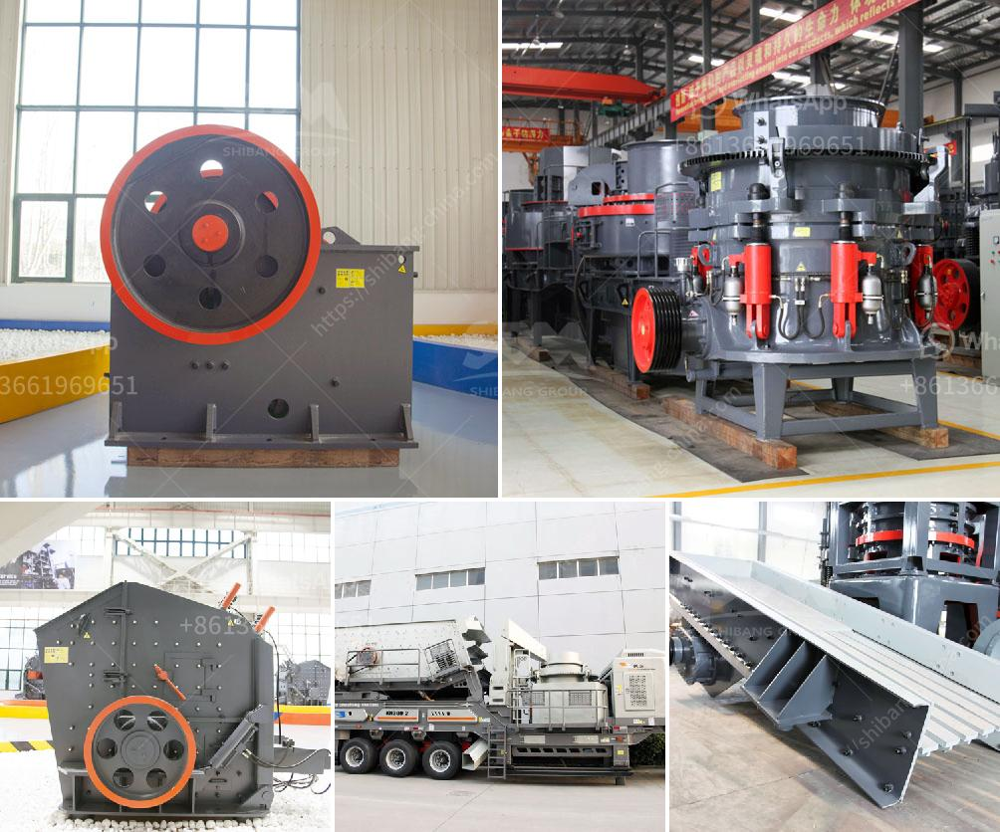

<h3>price of 500 tph stone crusher plant in malaysia</h3>
The price of the 500 tph stone crusher plant in Malaysia is related to the model, size and supplier of the equipment. As a leading global manufacturer of crushing and milling equipment, we provide a variety of stone crushers, such as jaw crusher, cone crusher, impact crusher, hammer crusher, etc. In addition, we provide professional consulting service about the cost of such equipment. Here, we focus on discussing the price of 500 tph stone crusher plant in Malaysia.

The price of the 500 tph stone crusher plant in Malaysia is range from RM 10,000 to RM 2,000,000. The specific price range depends on the raw materials you choose to procure, transportation cost, taxes, insurance, financing activities, etc. For contractors, quarry operators, recycling and mining applications, stone crushing industry is an important industrial sector to produce high quality aggregate and building materials.

However, with the rising price of construction materials, the increasing demand for sand and gravel, and the stricter regulations on mining and quarry, a lot of investors turn to the stone crushing industry, especially in Malaysia. Therefore, the investment cost calculations for a 500 tph stationary stone crusher plant are discussed in detail here.

The cost of a 500 tph stone crusher plant in Malaysia is based on the crushing capacity and the input and output size. The investment for stone crusher plant ranges from RM 20,000 to RM 30,000 for small-scale miners. The total cost of stone crusher plant for a 100 tph stone crushing unit in Malaysia range from RM 40,000 to RM 80,000. Factors affecting the price of stone crusher plant include material properties, production capacity (tph), degree of automation and regional factors.

Based on the way of crushing force, a crusher is designed to work with a certain maximum size of raw material. This type of machine uses the hydraulic point of view to regulate the size of the output. Size reduction ratio is limited to 5 to 6: I. Hammer mills work with reduction ratios as high as 1: 60; depending on the crusher feed, this ratio must be kept in mind at all times.

The stone crushing plant demands set by the customer is also influenced by the type of material to be crushed. These factors will help determine the success of the project. For example, the specific configuration of the conveyor belt, the main engine configuration and the electronic control box configuration, in which each configuration is different, can be configured according to the actual needs of customers.

In the customer's budget, our engineers combined with broken environment and requirements, designed energy-efficient sand line. Jaw crusher on the impact crusher crushing capacity and effect, making sand to do a good paving. Moreover, the whole production line has a high degree of automation and low manual operation. Less equipment failure, less maintenance.

Customers reduced labor costs, maintenance costs, and increased production. 2. Less wearing parts consumption, low running costs. Reasonable structure, advanced crushing principle and technical parameters, reliable operation and low running costs. With large crushing force, high production efficiency and high yield. Spring safety system is reliable and can provide safe and effective overload protection.

Type of stone crusher machine and model: stone crusher machine manufacturer in Malaysia. JXSC company stone & rock crushers include cone crusher, jaw crusher, impact crusher, mobile crusher, sand making machine, mobile crushing plant & hammer crushing which can crush with more than 200 kinds of industrial materials. Such as pebble, granite, basalt, iron ore, limestone, quartz, diabase, iron ore, gold, copper, etc. Primary and fine crushers are the type of crushing machine.
<h3>Contact us</h3><ul><li><strong>Whatsapp:&nbsp;<a href="https://wa.me/8613661969651">+8613661969651</a></strong></li><li><a href="https://swt.shibang-china.com/?git&amp;zhl&amp;price of 500 tph stone crusher plant in malaysia"><strong>Online Service(chat now)</strong></a></li></ul><h3>Related</h3><ul><li><a href='mining equipment for hire in kenya.md'>mining equipment for hire in kenya</a></li><li><a href='cost of ball mill 40tonns capacity.md'>cost of ball mill 40tonns capacity</a></li><li><a href='rock salt processing plant.md'>rock salt processing plant</a></li><li><a href='stone crusher to buy in bangalore.md'>stone crusher to buy in bangalore</a></li><li><a href='functions of gyratory crusher.md'>functions of gyratory crusher</a></li></ul>