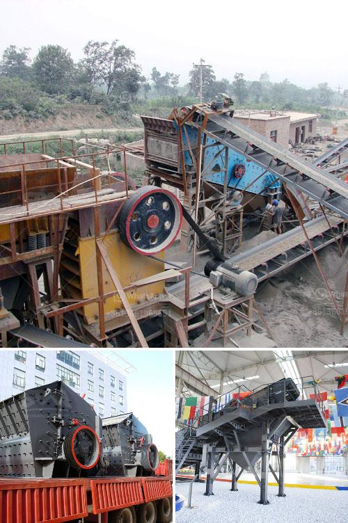

<h3>price of central vertical roller mill</h3>
The price of a central vertical roller mill is determined by several factors including the production capacity, power output, motor size, and other specifications of the machine. In general, the price range of these mills varies from around $70,000 to $3 million. However, it is important to note that these are just rough estimates, and the actual price can vary significantly based on various market conditions and supplier discounts.

One of the primary factors influencing the price of a central vertical roller mill is its production capacity. Mills with higher production capacities are generally priced at the higher end of the spectrum. This is because they are designed to handle larger volumes of materials, which requires stronger and larger components.

Another crucial factor impacting the price is the power output of the mill. Higher power output capability enables the mill to process materials more efficiently, resulting in higher productivity. Therefore, mills with greater power outputs often have higher prices due to their enhanced performance capabilities.

Motor size is another important factor influencing the price. Larger motors are generally more expensive, as they are built to handle higher loads and provide the necessary power output for large-scale industrial applications. Additionally, the price may be affected by the specific features and technologies incorporated into the mill, such as digital control systems, advanced safety mechanisms, or energy-saving features.

Lastly, market dynamics and supplier competitiveness can greatly impact the price of a central vertical roller mill. The availability of multiple suppliers in the market can lead to competitive pricing, as manufacturers strive to attract customers by offering more competitive prices or additional benefits.

When considering the purchase of a central vertical roller mill, potential buyers should thoroughly assess their needs and requirements in terms of production capacity, power output, and other specifications. It is advisable to consult various suppliers and gather multiple quotes to ensure a fair comparison and make an informed decision. Additionally, buyers should consider the after-sales services and technical support offered by suppliers, as this can add value to their investment in the long term.
<h3>Contact us</h3><ul><li><strong>Whatsapp:&nbsp;<a href="https://wa.me/8613661969651">+8613661969651</a></strong></li><li><a href="https://swt.shibang-china.com/?git&amp;zhl&amp;price of central vertical roller mill"><strong>Online Service(chat now)</strong></a></li></ul><h3>Related</h3><ul><li><a href='dolomite powder making machine for processing line.md'>dolomite powder making machine for processing line</a></li><li><a href='single cylinder hydraulic cone crusher.md'>single cylinder hydraulic cone crusher</a></li><li><a href='silica sand machinery manufacturer from india.md'>silica sand machinery manufacturer from india</a></li><li><a href='crusher machine in gujranwala location.md'>crusher machine in gujranwala location</a></li><li><a href='gypsum board manufacturing plant cost.md'>gypsum board manufacturing plant cost</a></li></ul>