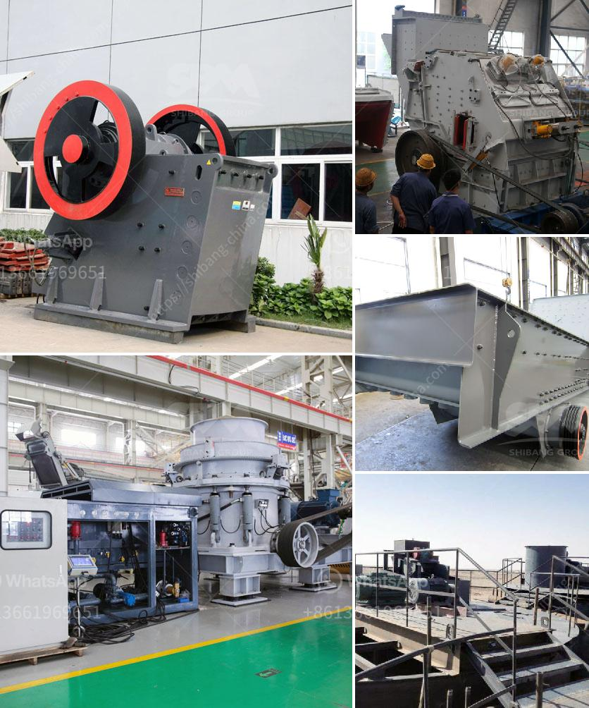

<h3>price of concrete crushing machine for sale</h3>
If you are in the market for a concrete crushing machine for sale, you are not alone. Concrete crushing is a common process in the construction industry, and many construction companies are opting to recycle concrete rather than dispose of it in landfills. Concrete can be crushed to various sizes and specifications to meet the needs of different projects, and there are many types of crushing machines available for this purpose.

The price of a concrete crushing machine for sale can vary depending on the nature of the job you need to have done and the size, brand, and model of the machine you choose to buy. Generally, prices will range from about $8,000 to several million dollars. Here are some factors that will affect the price:

1. Size and capacity: The size and capacity of the crushing machine will affect its price. Larger machines with higher capacities will generally cost more than smaller ones.

2. Brand and model: Different brands and models of crushing machines come with different price tags. Some brands are known for their high-quality and durable machines, while others may offer cheaper alternatives.

3. Features and specifications: Certain features and specifications, such as the ability to crush different types of concrete or the option to adjust the crushing size, may increase the price of the machine.

4. Condition: The condition of the machine, whether it is new or used, will also influence its price. Used machines may be cheaper but may have some wear and tear that could affect their performance.

Before making a purchase, it is crucial to consider your specific needs and budget. It is also advisable to research different brands, models, and suppliers to get an idea of market prices. Additionally, do not forget to factor in any additional costs such as delivery, installation, or maintenance.

Finally, it is worth noting that investing in a high-quality concrete crushing machine can be a profitable move in the long run. By recycling concrete and reducing waste, construction companies can save on disposal costs while contributing to a more sustainable and environmentally friendly industry.
<h3>Contact us</h3><ul><li><strong>Whatsapp:&nbsp;<a href="https://wa.me/8613661969651">+8613661969651</a></strong></li><li><a href="https://swt.shibang-china.com/?git&amp;zhl&amp;price of concrete crushing machine for sale"><strong>Online Service(chat now)</strong></a></li></ul><h3>Related</h3><ul><li><a href='used mining equipment for sale in ghana.md'>used mining equipment for sale in ghana</a></li><li><a href='project proposal on funding gold mining.md'>project proposal on funding gold mining</a></li><li><a href='chrome mining business plan.md'>chrome mining business plan</a></li><li><a href='mini cement plant project in india.md'>mini cement plant project in india</a></li><li><a href='jual ball mill second.md'>jual ball mill second</a></li></ul>