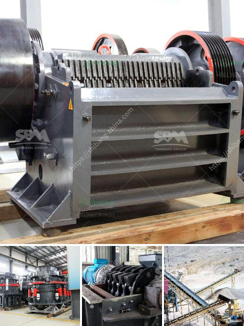

<h3>price of grinding machine in bangladesh</h3>
Bangladesh is a developing country, thus the demand for industrial machinery and equipment is increasing. With the steady rise of the manufacturing sector and expansion of industrial activities, the demand for grinding machines is also on the rise. The grinding machine price in Bangladesh is relatively reasonable and competitive compared to other industrial countries.

Grinding machines are used for material removal, finishing, and shaping operations. These machines come in various types, such as surface grinder, cylindrical grinder, tool and cutter grinder, and centerless grinder. Each has its specific purpose and applications. The price of grinding machines varies according to the type, brand, and specifications of the machine.

In Bangladesh, grinding machines are available at a wide range of prices, from entry-level options priced around BDT 10,000 to high-end models costing over BDT 50,000. The price depends on the production capability, power, and overall quality of the machine. Higher-priced machines often come with additional features, automation, and precision that can significantly enhance productivity and quality of the finished products.

One of the factors affecting the price of grinding machines in Bangladesh is the cost of raw materials used in their manufacturing. The cost of steel, casting materials, electrical components, and technological innovations all contribute to the final price of the machine. Additionally, the brand reputation and marketing expenses also affect the price tag.

Though the competition among manufacturers is intense, several major players dominate the market in Bangladesh. These companies offer grinding machines with a wide range of prices and features. Some of the popular brands available in the market include BOSCH, DEWALT, Makita, HITACHI, and SUMO. These brands have built a reputation for providing high-quality machines with reliable performance.

The grinding machine market in Bangladesh is also influenced by global trends and developments. As technology advances, new features and improvements are integrated into the machines, leading to an increase in cost. For example, in recent years, computer numerical control (CNC) technology has been incorporated into grinding machines, enabling more precision and automation in the process. Though such machines come at a higher price, they offer better efficiency and productivity in the long run.

For small-scale and medium-scale businesses in Bangladesh, investing in a grinding machine is a significant decision. It is crucial to consider the specific requirements and financial capability before making a purchase. Careful research, comparing prices and features, and consulting industry professionals can help in making an informed decision.

Moreover, it is important to take into account the maintenance and operational costs associated with grinding machines. Proper maintenance and regular servicing can extend the life of the machine, reduce downtime, and optimize performance. It is advisable to choose a machine with a reliable after-sales service network and availability of spare parts in the local market.

In conclusion, the price of grinding machines in Bangladesh varies depending on factors such as type, brand, and specifications. There is a wide range of options available, from affordable entry-level machines to high-end models. Considering the specific needs and budget, businesses can find the right grinding machine that offers efficient and cost-effective solutions for their manufacturing processes.
<h3>Contact us</h3><ul><li><strong>Whatsapp:&nbsp;<a href="https://wa.me/8613661969651">+8613661969651</a></strong></li><li><a href="https://swt.shibang-china.com/?git&amp;zhl&amp;price of grinding machine in bangladesh"><strong>Online Service(chat now)</strong></a></li></ul><h3>Related</h3><ul><li><a href='ball grinding mill india.md'>ball grinding mill india</a></li><li><a href='gypsum board manufacturing plant cost.md'>gypsum board manufacturing plant cost</a></li><li><a href='slag crusher for sale.md'>slag crusher for sale</a></li><li><a href='hydraulics in vertical ball mill.md'>hydraulics in vertical ball mill</a></li><li><a href='used stone crusher for sale in florida.md'>used stone crusher for sale in florida</a></li></ul>