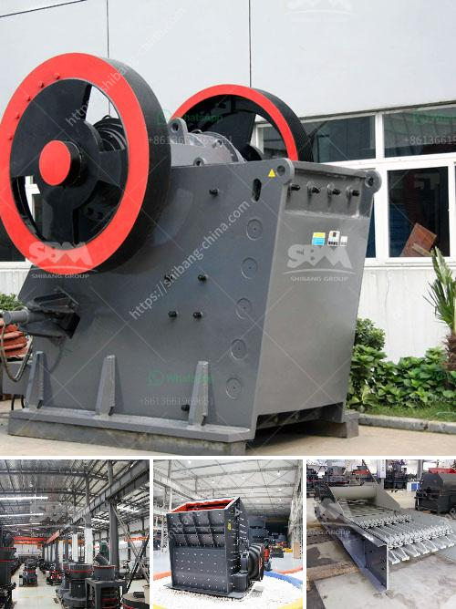

<h3>price of hammer mill in nigeria</h3>
The hammer mill is a machine used to shred or crush materials into smaller pieces. The basic design of machines of this type involves a rotating shaft on which free-swinging hammers are mounted. This assembly is enclosed by a drum which protects the hammers and also helps to control the particle size of the crushed material.

In Nigeria, hammer mills are widely utilized by small-scale farmers and rural communities for their agricultural needs. These machines have gained popularity due to their ability to process a wide variety of raw materials including grains, maize, and sorghum. Additionally, hammer mills are also capable of breaking oil seeds, palm kernel, cassava, and even bone meal. As such, hammer mills have become quite indispensable in industries such as food processing, pharmaceuticals, and animal feed production, among others.

The price of the hammer mill varies with the model, capacity, brand, and size. The production capacity ranges from 100kg/hr to 5000kg/hr, and it can be customized according to the specifications of the clients. Some of the key factors influencing the price include the processing capacity, power consumption, and the number of hammers.

On average, the price of a hammer mill in Nigeria is between 70,000 to 120,000 Naira. These prices are dependent on many factors, including manufacturing brand, capacity, and electricity supply in Nigeria. A hammer mill with 20 horsepower electric motor can process up to 100kg of grains in an hour, whereas the same model with a diesel engine can process up to 200kg of grains in an hour. Accordingly, the price for a hammer mill with electric motor is higher than that of a diesel-engine powered model.

Furthermore, specific modifications and add-ons such as cyclone collectors for improved dust control or automatic feeding mechanisms can affect the price. However, investing in these additional features can greatly enhance the efficiency and productivity of the machine.

It is important to note that hammer mills require regular maintenance and servicing to guarantee optimal performance. It is advisable to purchase from reputable suppliers who provide after-sales support and spare parts availability. This ensures that the machine can be repaired and maintained locally, reducing downtime and associated costs.

In conclusion, the price of a hammer mill in Nigeria varies depending on various factors. The machine’s capacity, power source, and additional features all play a role in determining the final price. Furthermore, investing in maintenance and servicing is crucial for prolonging the machine's lifespan and ensuring optimal performance. With these considerations in mind, farmers and industries in Nigeria can make informed decisions when purchasing hammer mills to meet their specific needs.
<h3>Contact us</h3><ul><li><strong>Whatsapp:&nbsp;<a href="https://wa.me/8613661969651">+8613661969651</a></strong></li><li><a href="https://swt.shibang-china.com/?git&amp;zhl&amp;price of hammer mill in nigeria"><strong>Online Service(chat now)</strong></a></li></ul><h3>Related</h3><ul><li><a href='stone crusher machine price in bangladesh.md'>stone crusher machine price in bangladesh</a></li><li><a href='brick crusher for sale.md'>brick crusher for sale</a></li><li><a href='vertical shaft impact crusher technical specifications.md'>vertical shaft impact crusher technical specifications</a></li><li><a href='crusher stone price bolivia.md'>crusher stone price bolivia</a></li><li><a href='biaya conveyor belt per meter instalasi.md'>biaya conveyor belt per meter instalasi</a></li></ul>