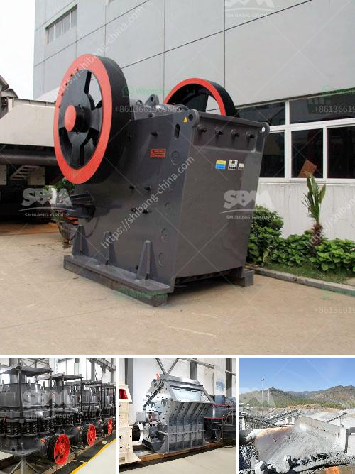

<h3>price of jaw crusher germany</h3>
The price of a jaw crusher in Germany has always been an important factor influencing the purchasing decision of investors. In recent years, the price of jaw crushers has been fluctuating. It is affected by various factors such as market demand, manufacturing cost, and economic conditions.

The jaw crusher market in Germany is facing intense competition. Among the major players, a large number of manufacturers are based in Germany, making it a highly competitive market. These manufacturers offer a wide range of jaw crushers with varying specifications and prices to cater to the diverse needs of the customers.

The price of a jaw crusher depends on its specifications, capacity, and features. Higher capacity jaw crushers are usually priced higher due to their ability to handle larger feed sizes and process more material efficiently. Similarly, jaw crushers with advanced features like hydraulic adjustment, overload protection, and automated control systems are usually priced higher than basic models.

Apart from the manufacturing cost and specifications, the price of a jaw crusher is also impacted by factors like market demand and economic conditions. During periods of high demand, the prices tend to rise as manufacturers capitalize on the increased demand. On the other hand, during periods of economic downturn or low demand, the prices may be relatively lower as manufacturers try to attract customers by offering competitive prices.

In conclusion, the price of a jaw crusher in Germany is influenced by various factors, including market demand, manufacturing cost, specifications, and economic conditions. Buyers should carefully consider their requirements and budget before making a purchasing decision. Comparing prices and features offered by different manufacturers is essential to ensure the best value for money.
<h3>Contact us</h3><ul><li><strong>Whatsapp:&nbsp;<a href="https://wa.me/8613661969651">+8613661969651</a></strong></li><li><a href="https://swt.shibang-china.com/?git&amp;zhl&amp;price of jaw crusher germany"><strong>Online Service(chat now)</strong></a></li></ul><h3>Related</h3><ul><li><a href='mobile rock crusher.md'>mobile rock crusher</a></li><li><a href='hammer mills factories.md'>hammer mills factories</a></li><li><a href='slag powder making.md'>slag powder making</a></li><li><a href='500tpd stone crushers.md'>500tpd stone crushers</a></li><li><a href='conveyor equipment in tanzania.md'>conveyor equipment in tanzania</a></li></ul>