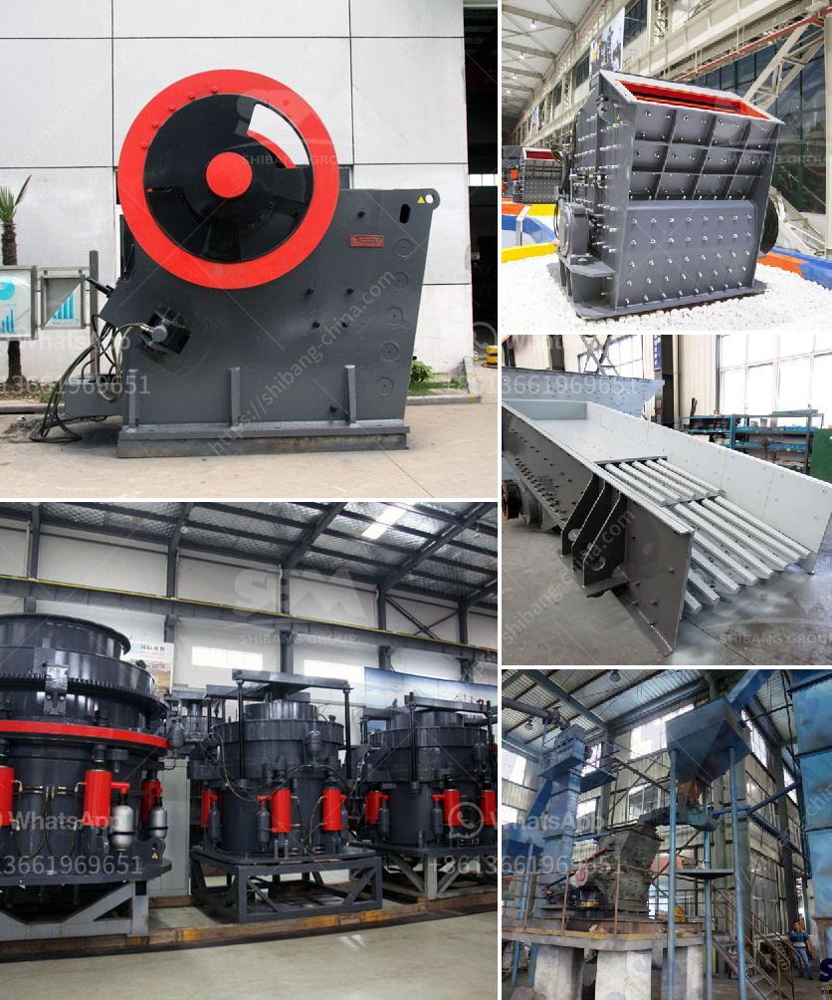

<h3>price of jaw crusher in zimbabwe</h3>
The price of a jaw crusher in Zimbabwe is based on the crushing capacity and the capacity per hour. It ranges from $ 5000 to $ 70000. The higher the crushing capacity, the more expensive the jaw crusher is and the more expensive the equipment price is. Shibang Machinery is a professional manufacturer of mining equipment and has been focusing on the development and production of crushing machinery for many years. We have rich experience in helping customers design and install jaw crushers and have a professional technical team to provide customers with comprehensive after-sales service.

The jaw crusher is a commonly used equipment in the mining industry. It has the characteristics of large crushing ratio, high efficiency, and low energy consumption. It is favored by customers due to its simple structure and reliable operation. However, the price of jaw crushers in Zimbabwe is not cheap, and many investors pay attention to it. So, what factors will affect the price of jaw crushers in Zimbabwe? Below, we will explain it in detail.

1. Production capacity: The production capacity of jaw crushers affects the price. The larger the production capacity, the higher the price. Different models of jaw crushers have different production capacities. When choosing a jaw crusher, you should consider your actual production needs and choose the most suitable one.

2. Quality of the equipment: The quality of the equipment will directly affect the price. High-quality jaw crushers are made of high-quality materials, have strong wear resistance, and have a longer service life. The price of high-quality jaw crushers will be higher than that of ordinary ones, but it will save users a lot of maintenance costs in the later stage.

3. Brand awareness: The price of jaw crushers with different brand awareness will vary. Famous brand jaw crushers have a strong reputation in the market, and the quality of their equipment is relatively guaranteed. Therefore, the price of jaw crushers of well-known brands will be higher.

4. After-sales service: The quality of after-sales service is also an important factor affecting the price of jaw crushers. Good after-sales service can help users solve various problems encountered in the use of equipment in a timely manner and reduce downtime. Therefore, when purchasing equipment, we must pay attention to the after-sales service of the manufacturer.

In summary, the price of jaw crushers in Zimbabwe is affected by various factors such as production capacity, quality of equipment, brand awareness, and after-sales service. When purchasing equipment, users should combine their actual needs, choose a reliable manufacturer, and consider the comprehensive cost performance to make a reasonable choice. Shibang Machinery is a trustworthy manufacturer and has won the trust and support of many customers with its high-quality products and excellent after-sales service.
<h3>Contact us</h3><ul><li><strong>Whatsapp:&nbsp;<a href="https://wa.me/8613661969651">+8613661969651</a></strong></li><li><a href="https://swt.shibang-china.com/?git&amp;zhl&amp;price of jaw crusher in zimbabwe"><strong>Online Service(chat now)</strong></a></li></ul><h3>Related</h3><ul><li><a href='secondary jaw crusher.md'>secondary jaw crusher</a></li><li><a href='limestone manufacturing machine.md'>limestone manufacturing machine</a></li><li><a href='turkey quarry crusher machines manufacturer.md'>turkey quarry crusher machines manufacturer</a></li><li><a href='impact rock crusher.md'>impact rock crusher</a></li><li><a href='sand screen machine.md'>sand screen machine</a></li></ul>