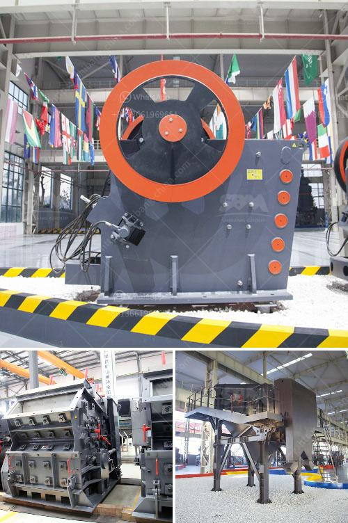

<h3>price of stone crusher machine</h3>
The price of stone crusher machine in India is often affected by factors such as location, manufacturer, quality, production capacity, and market demand. These factors are determined based on the knowledge and research of the stone crusher machine industry experts.

As a well-known crusher machine manufacturer and exporter in China, Zenith will provide you the most valuable stone crusher machines with fair price. Zenith stone crusher machine price is reasonable and competitive.

Typically, the 200 tph stone crushers having than one crusher i.e., one primary and one secondary or one primary & two secondary crushers along with one or more vibratory screens are categorized as medium size crushers. The mined stones are transported mostly by truck/dumpers and unloaded in to elevated stone wells. The stones are fed by gravity to primary crushers. The Crushed stones are conveyed to vibratory screens. The screened products of various sizes are conveyed to stock piles by belt conveyors. The oversize is returned to secondary crushers for further crushing and back to the vibratory screen. Such type of medium type crushers has a production capacity in the range of 25 – 100 TPH.

Typically, large stone crusher machine is needed when bigger size stones are required. Zenith offers scalable and robust stone crusher machine which are designed to meet customer's specific demands. They provide high performance and high capacity. Their crushers can handle a wide range of material including mineral, aggregate, gravel, limestone, coal, gold ore, copper ore, iron ore, bauxite, marble, granite, basalt, etc.

Stone Crusher Plant Dealer Group is a professional and old history stone crusher plant dealer and manufacturer in Shanghai, China. We have the largest and most detailed database of stone crusher plant manufacturer of stone crushers in India,stone crusher machine manufacturer in India manufacturer & stone crusher machine manufacturer in India ..

300-500 TPH Stone Crushing Machine Supplier Cost For Stone Crusher Plant Crusher,Indonesia stone crusher,Indonesia jaw crusher price,Indonesia cone . Read More × jaw crusher for sale in malaysia. Jaw Crusher Manufacturer, Complete Stone Crushing & Screening Solutions. 30-2000TPH Jaw Crusher, Rich Experience of Quarry & Crusher Plant .
<h3>Contact us</h3><ul><li><strong>Whatsapp:&nbsp;<a href="https://wa.me/8613661969651">+8613661969651</a></strong></li><li><a href="https://swt.shibang-china.com/?git&amp;zhl&amp;price of stone crusher machine"><strong>Online Service(chat now)</strong></a></li></ul><h3>Related</h3><ul><li><a href='france roller mills.md'>france roller mills</a></li><li><a href='horizontal grinding mills price.md'>horizontal grinding mills price</a></li><li><a href='concrete stone making machine south africa.md'>concrete stone making machine south africa</a></li><li><a href='secondary jaw crusher.md'>secondary jaw crusher</a></li><li><a href='quartz grinding plant.md'>quartz grinding plant</a></li></ul>