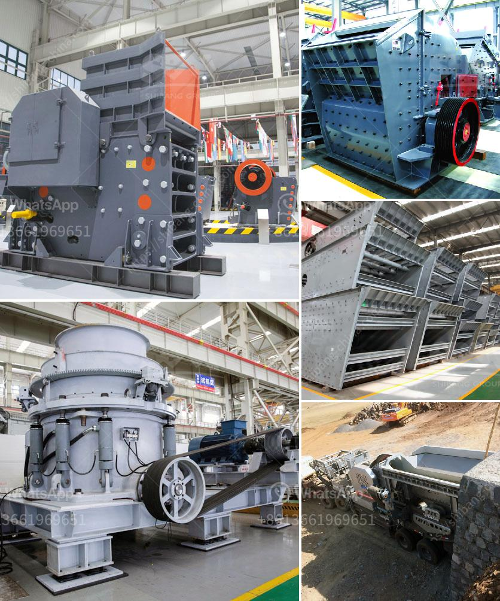

<h3>price of zenith jaw crusher</h3>
The price of a Zenith jaw crusher is related to the capacity it can handle, the materials it is made of, its size, and other factors. Different manufacturers have different prices of the same type of jaw crushers. Their prices are also varied, so it is difficult for customers to ascertain the specific price of a Zenith jaw crusher.

Generally speaking, the price of a Zenith jaw crusher ranges from around $10,000 to $1,000,000. The specific price depends on the factors mentioned above. In addition, the jaw crusher has different models with different output capacities. For example, the PE jaw crusher is generally used for coarse crushing and has a capacity of 1-1000t/h, while the PEX jaw crusher, mainly used for secondary and fine crushing, has a capacity of 3-500t/h.

When purchasing a jaw crusher, customers should determine their own needs according to their production requirements, output size, and other factors. They can then consult with the manufacturer to get the specific price. It is recommended to compare prices from different manufacturers and select the most cost-effective one. However, customers should be cautious of manufacturers who offer extremely low prices as their products may have quality issues.

In conclusion, the price of a Zenith jaw crusher varies depending on different factors such as capacity, materials, and size. Customers should carefully consider their requirements and consult with the manufacturer to get the most suitable and cost-effective jaw crusher. By doing so, they can ensure a successful and efficient crushing process.
<h3>Contact us</h3><ul><li><strong>Whatsapp:&nbsp;<a href="https://wa.me/8613661969651">+8613661969651</a></strong></li><li><a href="https://swt.shibang-china.com/?git&amp;zhl&amp;price of zenith jaw crusher"><strong>Online Service(chat now)</strong></a></li></ul><h3>Related</h3><ul><li><a href='rock crushing machine price.md'>rock crushing machine price</a></li><li><a href='coal mining machines for sale.md'>coal mining machines for sale</a></li><li><a href='how to make talcum powder in the escapists.md'>how to make talcum powder in the escapists</a></li><li><a href='iron ore 100 150tph belt conveyor price.md'>iron ore 100 150tph belt conveyor price</a></li><li><a href='quarry aggregate crusher manufacturing process ppt.md'>quarry aggregate crusher manufacturing process ppt</a></li></ul>