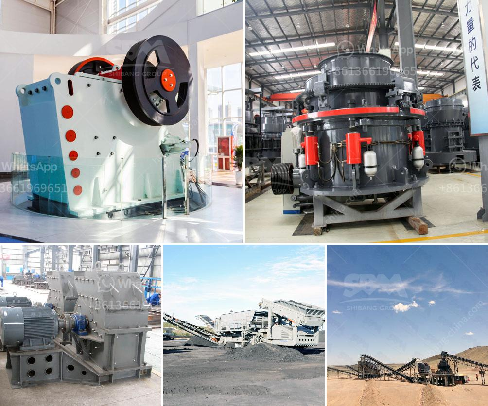

<h3>price quarry stone crusher</h3>
A quarry crusher is a machine used to crush stones from large size to smaller size in the quarry production process. In order to get the desired size materials, these crushers are normally used by mining companies and construction companies. The materials that can be crushed by a quarry crusher include limestone, marble, granite, basalt, pebble, andesite, diabase, etc.

The price of a quarry crusher depends on the types and models of the machines. In younger years, primary crushers were typically jaw crushers, which feature a fixed jaw plate and a moving jaw plate. These jaw crushers are used to crush large rocks into smaller pieces for further processing such as ballast production, ore crushing, and sand making. Nowadays, the market offers various types of stone crushers including cone crushers, impact crushers, and hammer crushers. Each type has its own advantages and different output capacities.

In terms of pricing, a quarry stone crusher can range in price between $55,000 and $200,000. The starting price point will depend on the machine's features, capacity, and output. Some models may include features such as hydraulic adjustment or reversible jaw dies. These additional features can increase the price of the machine. On the other hand, smaller crushers with less production capacity will be more affordable.

Other factors that can affect the price of a quarry stone crusher include the brand, market demand, and location. Some popular brands in the market include Metso, Sandvik, and Terex. These brands are known for their high-quality and durable crushers, which generally have higher prices compared to lesser-known or generic brands. Additionally, the market demand for quarry crushers can also affect their price. During times of high demand, the prices may increase, while during low demand, the prices may decrease. The location of the quarry can also play a role in the price of the crusher. Transportation costs can vary depending on the distance between the quarry and the customer, which can affect the overall price.

When considering the purchase of a quarry stone crusher, it is important to compare prices and features from different suppliers. It is advisable to research and inquire about warranties, after-sales services, and availability of spare parts. Additionally, it is crucial to understand the specific requirements and production needs of the project to ensure that the chosen crusher will meet those needs.

In conclusion, the price of a quarry stone crusher can vary widely depending on the types and models of the machines, as well as other factors such as brand, market demand, and location. It is important for buyers to thoroughly research and compare prices from different suppliers to find the best value for their investment. Additionally, considering the features, capacity, and after-sales services of the crusher is essential to ensure its suitability for specific projects.
<h3>Contact us</h3><ul><li><strong>Whatsapp:&nbsp;<a href="https://wa.me/8613661969651">+8613661969651</a></strong></li><li><a href="https://swt.shibang-china.com/?git&amp;zhl&amp;price quarry stone crusher"><strong>Online Service(chat now)</strong></a></li></ul><h3>Related</h3><ul><li><a href='cone crushers south africa.md'>cone crushers south africa</a></li><li><a href='rock processing plant.md'>rock processing plant</a></li><li><a href='quartz powder machine manufacturer in india.md'>quartz powder machine manufacturer in india</a></li><li><a href='rock crushers uk.md'>rock crushers uk</a></li><li><a href='rock quarry sizing process.md'>rock quarry sizing process</a></li></ul>