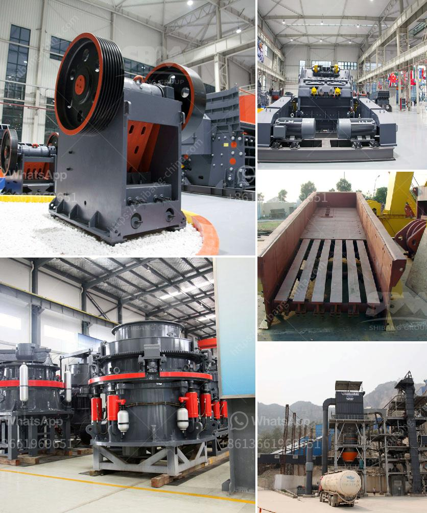

<h3>prices of hammer mill in zimbabwe</h3>
The hammer mill has swiftly become a household name among the milling fraternity due to its high efficiency and ability to process grains into various sizes. In recent years, Zimbabweans have increasingly turned to hammer mills to meet their milling needs, thereby transforming it into an essential component within the agricultural sector.

The prices of hammer mills in Zimbabwe are quite favorable when compared to other machinery available in the market. Hammer mills are predominantly used for the production of ground animal feed, such as in poultry and livestock industries. Although they are also utilized in the creation of various other goods such as maize meal, vegetable oil, soap, and ticket flour.

One major factor that influences the prices of hammer mills in Zimbabwe is the availability of raw materials. The main raw material in this industry is maize and a vast majority of manufacturers rely on yellow maize as their product base. The price of maize varies due to several factors such as seasonal variations, transportation costs, and political instability. Consequently, these factors have a direct impact on the pricing structure of hammer mills.

Furthermore, the size and capacity of the machine also play a significant role in determining its cost. Hammer mills come in various sizes, ranging from small scale mills meant for domestic use to large industrial mills. The bigger the mill, the more expensive it becomes due to enhanced production capacity and advanced features. However, regardless of the size, all hammer mills serve the same purpose - to grind maize into flour.

On average, the price range for a basic hammer mill with a 10-15 horsepower motor is around $600-$800. This includes the mill, hopper, and electric motor, but excludes any installation costs or additional accessories. The prices increase as the motor size and capacity of the mill increase, with larger models ranging from $1,000 to $10,000.

It is worth noting that the prices provided are only indicative and may vary depending on the manufacturer, location, and market demand. Additionally, the availability of spare parts and maintenance services in the region is crucial, as they directly impact the long-term cost-effectiveness of owning a hammer mill.

To conclude, hammer mills have become an integral part of the Zimbabwean milling industry due to their efficiency and versatility. The prices of hammer mills in Zimbabwe are determined by multiple factors such as raw material availability, mill size, motor capacity, and market demand. It is advisable for prospective buyers to do thorough research, compare prices and consider long-term maintenance costs before making a purchase. With the right investment, a hammer mill can positively impact the productivity and profitability of various industries, while also contributing to Zimbabwe's economic growth.
<h3>Contact us</h3><ul><li><strong>Whatsapp:&nbsp;<a href="https://wa.me/8613661969651">+8613661969651</a></strong></li><li><a href="https://swt.shibang-china.com/?git&amp;zhl&amp;prices of hammer mill in zimbabwe"><strong>Online Service(chat now)</strong></a></li></ul><h3>Related</h3><ul><li><a href='the cost of a clay brick making machine in south africa.md'>the cost of a clay brick making machine in south africa</a></li><li><a href='open cast mining equipment for sale south africa.md'>open cast mining equipment for sale south africa</a></li><li><a href='sand washing machine in sri lanka.md'>sand washing machine in sri lanka</a></li><li><a href='china quartz sand dryer manufacturer.md'>china quartz sand dryer manufacturer</a></li><li><a href='portable stone crusher rajasthan.md'>portable stone crusher rajasthan</a></li></ul>