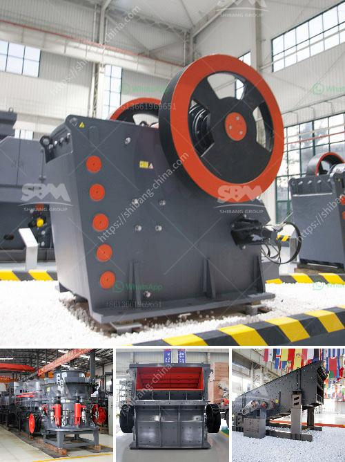

<h3>prices of small gold processing machine</h3>
The prices of small gold processing machines vary greatly based on their size, capacity, and capabilities. These machines are designed to efficiently extract gold particles from raw ore and convert them into marketable gold products.

Typically, the price range of small gold processing machines starts from around $1,000 and can go up to $20,000 or more. However, it is important to note that these figures are just rough estimates and can fluctuate depending on factors such as quality, brand, and additional features.

One of the primary factors contributing to the price variation is the size of the machine. Smaller machines with lower capacity are generally more affordable, while larger machines with higher capacity are more expensive. The capacity of these machines can range from a few grams to several kilograms per hour.

Another aspect that affects the price is the functionality of the machine. Basic gold processing machines with limited features like manual operation and basic controls tend to be cheaper compared to more advanced, automated machines that come equipped with digital interfaces, temperature control, and precise settings.

Moreover, the brand and reputation of the manufacturer also significantly impact the price of the machine. Renowned brands with a track record of delivering efficient and reliable gold processing machines often charge a premium for their products.

When shopping for a small gold processing machine, it is important to consider your specific requirements and budget. Assessing factors such as desired capacity, functionality, and long-term maintenance costs is crucial to make an informed decision. Additionally, comparing prices from different manufacturers and suppliers can help you find the best deal within your budget.

In conclusion, the prices of small gold processing machines can vary significantly depending on factors such as size, capacity, functionality, brand reputation, and additional features. It is wise to thoroughly assess your requirements and explore different manufacturers to find a machine that strikes the right balance between affordability and efficiency.
<h3>Contact us</h3><ul><li><strong>Whatsapp:&nbsp;<a href="https://wa.me/8613661969651">+8613661969651</a></strong></li><li><a href="https://swt.shibang-china.com/?git&amp;zhl&amp;prices of small gold processing machine"><strong>Online Service(chat now)</strong></a></li></ul><h3>Related</h3><ul><li><a href='cost of limestone crusher plant.md'>cost of limestone crusher plant</a></li><li><a href='how much does a stone crusher mill.md'>how much does a stone crusher mill</a></li><li><a href='which way should the ball mill rotate.md'>which way should the ball mill rotate</a></li><li><a href='granite and marble business plan pdf.md'>granite and marble business plan pdf</a></li><li><a href='jaw crusher price suppliers.md'>jaw crusher price suppliers</a></li></ul>