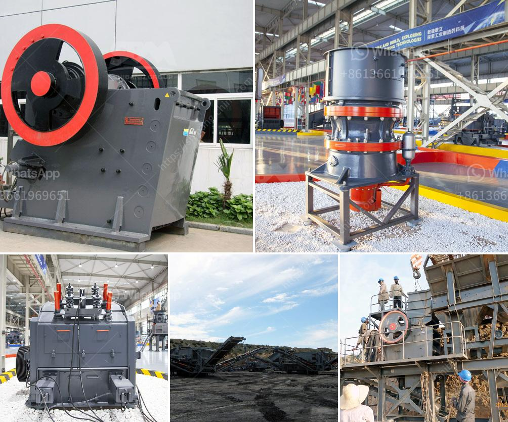

<h3>priducer prices for stone crusher in usa</h3>
Producer prices for stone crusher in the United States have remained steady over the past few years. These prices have remained relatively stable despite the fact that the cost of raw materials for the production of these crushers has also continued to rise. The construction industry has been a major driver of the increase in production prices for these machines.

Stone crushers are widely used in the mining, construction, and building material industries. Stone crushing equipment has become increasingly popular in recent years due to its versatility and efficiency. These machines are able to break down large rocks into gravel or smaller sizes for use in various construction projects.

The production of stone crushers involves the use of a variety of heavy-duty machinery. The primary machinery involved in the stone crushing process includes jaw crushers, impact crushers, cone crushers, hammer crushers, and screens. These machines work together to break down and process a variety of raw materials such as limestone, granite, basalt, and river stones.

One of the main factors contributing to the stability of producer prices for stone crushers in the United States is the relatively competitive market. There are several manufacturers and suppliers of stone crushing equipment in the country, which has led to healthy competition. This competition helps to keep prices in check and prevents any one manufacturer from monopolizing the market.

However, the cost of raw materials used in the manufacturing of stone crushers has been increasing steadily. The prices of steel, which is the main raw material for manufacturing these machines, have been on the rise in recent years. This increase in raw material prices has put pressure on manufacturers to find ways to reduce production costs without compromising on the quality of their products.

To counter the rising costs of raw materials, many stone crusher manufacturers have introduced technological advancements in their production processes. These advancements have helped improve the efficiency of stone crushers while also reducing the amount of raw materials required for their production. These technological improvements have allowed manufacturers to maintain stable producer prices even in the face of rising raw material costs.

In conclusion, producer prices for stone crushers in the United States have remained steady despite the increase in raw material costs. This stability can be attributed to healthy competition among manufacturers, as well as technological advancements in the production processes. Stone crushers continue to be in high demand in the construction industry, driving the need for efficient and cost-effective crushing equipment. With the continuous demand, stone crusher prices in the USA are likely to remain stable, benefiting both manufacturers and consumers.
<h3>Contact us</h3><ul><li><strong>Whatsapp:&nbsp;<a href="https://wa.me/8613661969651">+8613661969651</a></strong></li><li><a href="https://swt.shibang-china.com/?git&amp;zhl&amp;priducer prices for stone crusher in usa"><strong>Online Service(chat now)</strong></a></li></ul><h3>Related</h3><ul><li><a href='sand washing plant in turkey.md'>sand washing plant in turkey</a></li><li><a href='rock crushing plants.md'>rock crushing plants</a></li><li><a href='jaw crusher 200 tph parts details.md'>jaw crusher 200 tph parts details</a></li><li><a href='coal preparation plant cost.md'>coal preparation plant cost</a></li><li><a href='stone crushers for sale usa.md'>stone crushers for sale usa</a></li></ul>