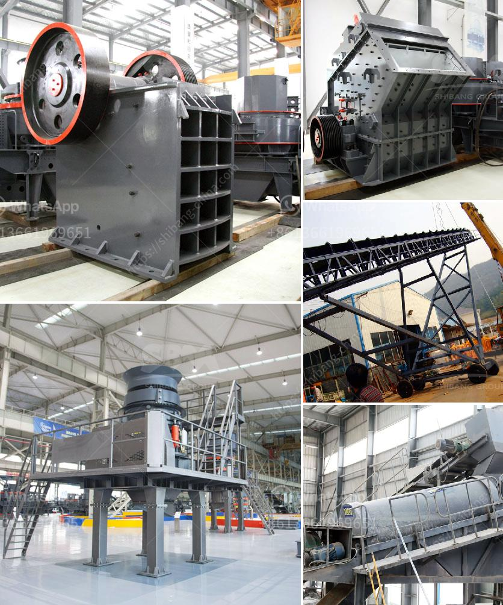

<h3>primary crushers</h3>
When it comes to mining and mineral processing, the first step usually involves blasting the rocks from the ground using explosives. The blasted rocks are then loaded into heavy-duty haul trucks and transported to a primary crusher. These machines are responsible for breaking down the rocks into smaller, more manageable sizes, which can then be further processed.

Primary crushers are a crucial component in the mineral processing industry, where their primary purpose is to reduce the size of raw materials. Whether it is quarried stone or ores, these machines offer an efficient and energy-saving solution for the initial crushing of large rocks.

There are several types of primary crushers commonly used in mining operations. Feeders, jaw crushers, impact crushers, and gyratory crushers are the most common methods used to reduce the size of rocks.

Feeders are commonly used to feed primary crushers, as they allow for a controlled flow of material to the crusher. This not only helps in maintaining a consistent feed rate but also prevents the crusher from getting overloaded, thus reducing the risk of damage to the machine.

Jaw crushers are widely used in the mining industry for their ability to crush hard materials, such as granite and basalt, as well as recyclable materials. These machines feature a series of jaws, one fixed and one moving, that apply force to the material, resulting in the breaking down of large rocks.

Impact crushers utilize the principle of rapid impact to crush and reduce the size of rocks. They are commonly used in the construction industry to produce gravel, asphalt, and concrete. This type of crusher utilizes high-speed impacts to break rocks, resulting in a cubical final product.

Gyratory crushers are recognized as one of the most efficient crushers in the mining industry for large-scale operations. These machines have a conical shape and a large opening at the top, which allows for the crushing of rocks with a high feed size. In addition, they have a higher capacity compared to jaw crushers and impact crushers.

The choice of which type of primary crusher to use depends on several factors, including the feed size, hardness, and abrasiveness of the material, as well as the required product size. Each type of crusher has its own advantages and disadvantages, and it is essential to select the most suitable one for each specific application.

In addition to their primary function of breaking down rocks, primary crushers also play a crucial role in operating efficiently within the overall mineral processing plant. They contribute to reducing the overall energy consumption, minimizing downtime, and optimizing the crushing circuit's performance.

In conclusion, primary crushers play a vital role in the mining and mineral processing industry. They are responsible for reducing the size of large rocks, making them more manageable for subsequent processing. Choosing the right type of primary crusher for a specific application is essential to ensure optimum performance and efficiency in the overall process. With technological advancements, primary crushers continue to evolve, offering improved efficiency, reduced maintenance requirements, and enhanced safety features.
<h3>Contact us</h3><ul><li><strong>Whatsapp:&nbsp;<a href="https://wa.me/8613661969651">+8613661969651</a></strong></li><li><a href="https://swt.shibang-china.com/?git&amp;zhl&amp;primary crushers"><strong>Online Service(chat now)</strong></a></li></ul><h3>Related</h3><ul><li><a href='portable silica sand washing machine.md'>portable silica sand washing machine</a></li><li><a href='dry grinding ball mills for lime.md'>dry grinding ball mills for lime</a></li><li><a href='rotary dryer in cement industry.md'>rotary dryer in cement industry</a></li><li><a href='ball mill for silica sand.md'>ball mill for silica sand</a></li><li><a href='cost of crusher machine kenya.md'>cost of crusher machine kenya</a></li></ul>