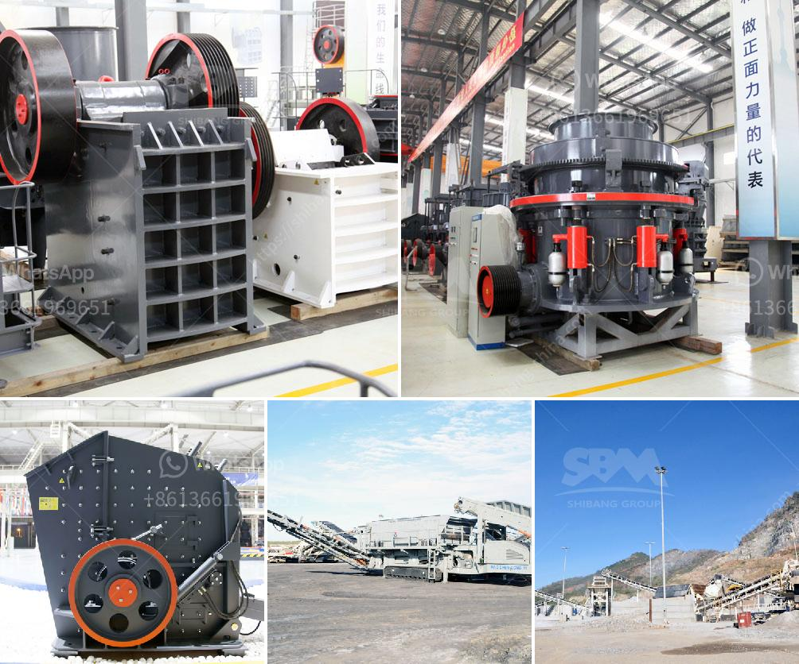

<h3>primary double deck screen price</h3>
In various industries such as mining, quarrying, and construction, the primary double deck screen plays a crucial role in the process of separating different sizes of material. These screens are known for their efficiency, high-capacity output, and versatility. However, before investing in such equipment, it is important to understand the factors affecting its price and the range of options available.

1. Size and Capacity: The size and capacity of the primary double deck screen are directly proportional to its price. Screens with larger dimensions capable of handling higher volumes of material are usually priced higher due to their increased output capabilities.

2. Material and Design: The quality of materials used in construction significantly impacts the overall price. Heavy-duty primary double deck screens constructed with premium wear-resistant materials are more expensive. Similarly, screens with innovative designs and features that enhance efficiency may have a higher price tag.

3. Brand Reputation: Well-established brands with a strong reputation for supplying reliable and durable equipment often charge a premium. Such brands have invested in research and development to improve their products' performance and longevity, leading to higher prices that may be justified by their track record.

4. Customization Options: Certain industries may require specific design modifications to suit their unique needs. Customization options like adjustable screening angles, various screen openings, or additional screening decks increase manufacturing complexity and, consequently, the price.

Given the aforementioned factors, the price of primary double deck screens can vary greatly. The price range typically falls between $10,000 and $200,000, depending on the screen's size, capacity, brand, and customization options. It is advisable to research and compare different models and brands to find the best balance between cost and functionality.

1. Brand A: Known for its extensive range of heavy-duty screens, Brand A offers primary double deck screens designed to withstand rigorous operating conditions. These screens are priced between $40,000 and $70,000, reflecting their premium quality and durability.

2. Brand B: Focusing on cost-effective solutions without compromising performance, Brand B's primary double deck screens range from $15,000 to $30,000. These screens are popular among budget-conscious buyers without compromising on basic screening requirements.

3. Brand C: Combining innovative features with customizable options, Brand C offers primary double deck screens priced between $80,000 to $150,000. These high-end screens cater to industries that demand advanced screening capabilities, allowing for precise material separation.

Investing in a primary double deck screen requires careful consideration of various factors, including size, capacity, materials used, brand reputation, and customization options. The price range for these screens can vary significantly, necessitating research and comparison of different models and brands. By understanding the factors affecting the price, potential buyers can make informed decisions, ensuring that they obtain the most suitable primary double deck screen within their budget.
<h3>Contact us</h3><ul><li><strong>Whatsapp:&nbsp;<a href="https://wa.me/8613661969651">+8613661969651</a></strong></li><li><a href="https://swt.shibang-china.com/?git&amp;zhl&amp;primary double deck screen price"><strong>Online Service(chat now)</strong></a></li></ul><h3>Related</h3><ul><li><a href='equipment mining grinding equipment for mezcal price.md'>equipment mining grinding equipment for mezcal price</a></li><li><a href='cement company in protea glen.md'>cement company in protea glen</a></li><li><a href='feldspar grinding mill suppliers india.md'>feldspar grinding mill suppliers india</a></li><li><a href='limestone ball mill italy.md'>limestone ball mill italy</a></li><li><a href='copper concentrate plant equipment list.md'>copper concentrate plant equipment list</a></li></ul>