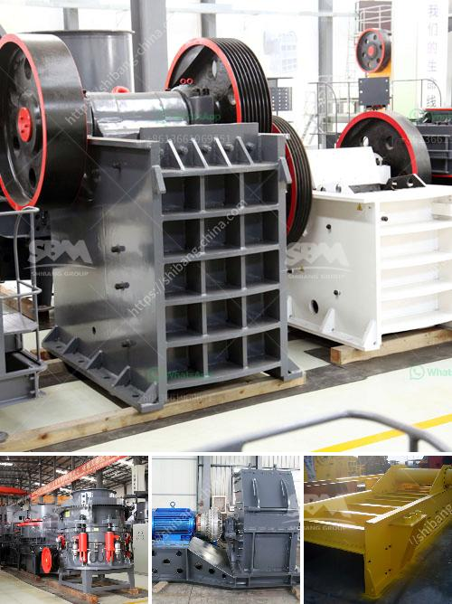

<h3>process of a granite crusher machine</h3>
The granite crusher machine is a crushing equipment that uses impact energy to crush materials. It processes various ores and rocks under medium and medium hardness conditions. That is, it is suitable for crushing granite, basalt, limestone, pebble, cement clinker, quartz stone, iron ore, bauxite and other minerals.

The granite crusher machine requires a certain feed size range to work properly. In different crushing stages, the equipment needs to process different feed sizes. If the required feed size is not met, it may cause abnormal operation of the equipment, which will affect the crushing capacity of the machine.

In the feeding process of the granite crusher machine, the material enters the crushing chamber evenly through the vibrating feeder. The jaw crusher is used as the primary equipment for crushing granite. It mainly crushes granite with a particle size of less than 500 mm. The processed granite is transported to the second crusher (impact crusher or cone crusher) through belt conveyor to crush again, forming a closed circuit for multiple cycles. The particle size of the finished product can be combined and graded according to the user's needs, which can protect the environment, save resources and reduce the production cost of the machine.

The granite crusher machine adopts high-speed impact and grinding, which reduces the wear and tear of the machine and extends the service life of the equipment. Its discharge granularity is adjustable, and the discharge particle size can be adjusted according to the user's needs, which is convenient and flexible. The structure of the machine is simple and compact, the floor space is small, and the maintenance and repair are convenient. The machine is equipped with a dust-proof device, which effectively reduces dust pollution and keeps the working environment clean and tidy.

In terms of operation, the granite crusher machine has a simple operation process, high degree of automation, low failure rate, flexible operation, energy saving and environmental protection, and good material shape. The equipment configuration of the entire production line is mainly determined by the customer's specifications and use requirements. The main components of the granite crusher machine include the frame, eccentric shaft, large pulley, flywheel, side guard, toggle plate, toggle plate rear seat, clearance screw, return spring, fixed jaw and movable jaw, etc., among which the toggle plate also has the effect of protecting the machine.

In summary, the granite crusher machine has a simple structure, high crushing efficiency, high output, long service life, flexible operation, energy saving and environmental protection, and good material shape. It is a good helper for the crushing of granite. With the increasing demand for fine sand in the market, it is also a hot-selling equipment in sand production lines. According to the specific needs of customers, it can provide customized solutions and configuration designs, providing customers with high-quality crushing equipment and reliable after-sales service.
<h3>Contact us</h3><ul><li><strong>Whatsapp:&nbsp;<a href="https://wa.me/8613661969651">+8613661969651</a></strong></li><li><a href="https://swt.shibang-china.com/?git&amp;zhl&amp;process of a granite crusher machine"><strong>Online Service(chat now)</strong></a></li></ul><h3>Related</h3><ul><li><a href='hard stone aggregate crusher price.md'>hard stone aggregate crusher price</a></li><li><a href='roller for plate mill manufacturer.md'>roller for plate mill manufacturer</a></li><li><a href='limestone powder mill in bankura.md'>limestone powder mill in bankura</a></li><li><a href='trommel ball mill.md'>trommel ball mill</a></li><li><a href='10 tpd grindig mill manufacturers philippines.md'>10 tpd grindig mill manufacturers philippines</a></li></ul>