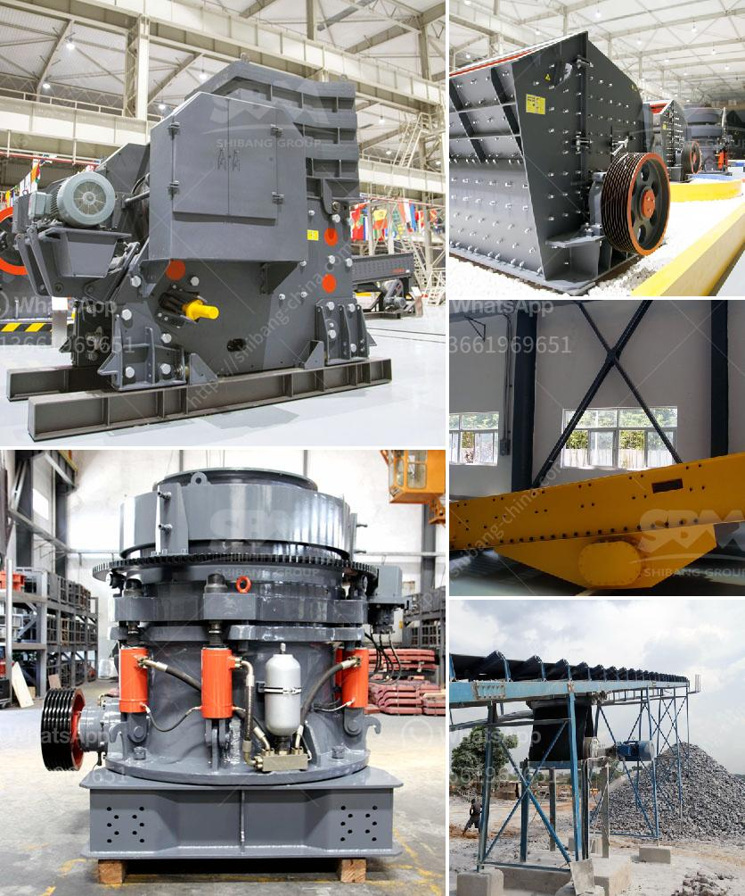

<h3>process of talcum powder mill</h3>
The process of talcum powder milling can be divided into four stages: crushing, drying, grinding, and packaging. First, talcum powder is crushed into small particles by jaw crusher. Then, the particles are sent to the dryer unit to be dried thoroughly. After that, they are transported to the grinding mill machine to be ground into fine powder. Finally, the powdered talc is packaged for distribution.

The first stage of the talcum powder milling process is crushing. This is usually done by jaw crushers, which are designed to break large chunks of talc into smaller pieces. The crushed talc particles are then conveyed to the drying unit.

In the drying stage, the crushed talc is exposed to hot air to remove any moisture content. This is important because talc contains water molecules that need to be evaporated before it can be further processed. The drying process ensures that the talc is free from any excess moisture, which can affect the final product's quality.

Once dried, the talc particles are sent to the grinding mill machine for further processing. The grinding mill machine uses mechanical force to break down the talc particles into even finer powder. This process is highly controlled to ensure that the resulting talcum powder has a consistent particle size and texture.

The grinding mills used for talcum powder milling can vary in terms of design and capacity. Some common types include ball mills, hammer mills, and Raymond mills. Ball mills are used for the finest grinding of talc particles and are well-suited for producing products in the range of 60-3000 mesh. Hammer mills, on the other hand, are more suitable for coarse grinding.

After the talcum powder has been ground to the desired fineness, it is then packaged for distribution. Packaging is an important step as it helps protect the product from contamination and ensures that it reaches the consumer in its intended form.

Packaging for talcum powder can range from simple plastic bags to more sophisticated containers with dispensers for easy application. Depending on the market demand, talcum powder can be packaged in various sizes, such as small travel-sized containers or larger bulk quantities.

In conclusion, the process of talcum powder milling involves crushing, drying, grinding, and packaging. Each stage is crucial in ensuring that the final product meets the desired quality and consistency. With the right equipment and careful monitoring, talcum powder manufacturers can produce a high-quality product that is safe for use.
<h3>Contact us</h3><ul><li><strong>Whatsapp:&nbsp;<a href="https://wa.me/8613661969651">+8613661969651</a></strong></li><li><a href="https://swt.shibang-china.com/?git&amp;zhl&amp;process of talcum powder mill"><strong>Online Service(chat now)</strong></a></li></ul><h3>Related</h3><ul><li><a href='powder grinfing mill sale.md'>powder grinfing mill sale</a></li><li><a href='barite beneficiation.md'>barite beneficiation</a></li><li><a href='carbonate crusher price per ton.md'>carbonate crusher price per ton</a></li><li><a href='gypsum powder production line manufacturers germany.md'>gypsum powder production line manufacturers germany</a></li><li><a href='cost of manganese beneficiation plant.md'>cost of manganese beneficiation plant</a></li></ul>