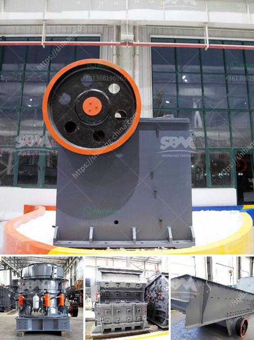

<h3>processing of feldspar crushing</h3>
Feldspar is a common raw material used in glass manufacturing, ceramics, and other industries. It is a mineral composed primarily of aluminum and silica along with small amounts of other elements such as potassium, sodium, and calcium. To extract feldspar from the earth, it is usually crushed and processed into smaller particles for various applications.

The processing of feldspar begins with crushing the raw material. Crushed feldspar particles are then meshed into a variety of sizes, depending on the desired final product. The material is crushed and ground into a powder, which is then screened to identify the necessary size range for further processing.

One of the most common methods used to process feldspar is flotation. This process involves adding certain chemicals to the crushed material to make it hydrophobic, or water-repellent. This enables the separation of feldspar from other minerals and impurities, as feldspar particles become attached to air bubbles and rise to the surface, allowing for easy removal.

Flotation is often followed by magnetic separation to further refine the feldspar product. This process utilizes magnetic properties of feldspar particles to separate them from other minerals. By applying a magnetic field, the feldspar particles are attracted to the magnetic surface, while non-magnetic impurities are left behind.

After magnetic separation, the feldspar concentrate is further processed using various techniques to achieve the desired quality and specifications. These processes may include cleaning, drying, and grinding the concentrate to produce fine powder or pellets. The final product is then ready for further industrial uses.

The processing of feldspar is not only important for separating it from other minerals but also to remove impurities that may affect its quality and usability. Impurities such as iron oxides, mica, and other minerals can negatively impact the performance and appearance of feldspar-based products. Therefore, various purification methods are applied to ensure the final product meets the required standards.

Besides flotation and magnetic separation, additional techniques such as gravity separation, high-intensity magnetic separation, and froth flotation may be used depending on the specific characteristics of the feldspar deposit. Each method offers its own advantages and disadvantages in terms of efficiency, effectiveness, and cost.

In conclusion, the processing of feldspar involves several stages to extract and refine the mineral for various industrial applications. Crushing and grinding the raw material is the first step, followed by flotation and magnetic separation to separate feldspar from impurities. Additional processing techniques are then applied to purify the feldspar concentrate and meet the desired quality standards. The final product is a crucial raw material used in glass, ceramics, and other industries, contributing to various products in our everyday lives.
<h3>Contact us</h3><ul><li><strong>Whatsapp:&nbsp;<a href="https://wa.me/8613661969651">+8613661969651</a></strong></li><li><a href="https://swt.shibang-china.com/?git&amp;zhl&amp;processing of feldspar crushing"><strong>Online Service(chat now)</strong></a></li></ul><h3>Related</h3><ul><li><a href='cement mills cement from the other.md'>cement mills cement from the other</a></li><li><a href='business plan for a quarry crusher.md'>business plan for a quarry crusher</a></li><li><a href='list of compartment of gypsum crusher plant.md'>list of compartment of gypsum crusher plant</a></li><li><a href='used rock fine crusher for sale.md'>used rock fine crusher for sale</a></li><li><a href='cost of clinker grinding and cement plant.md'>cost of clinker grinding and cement plant</a></li></ul>