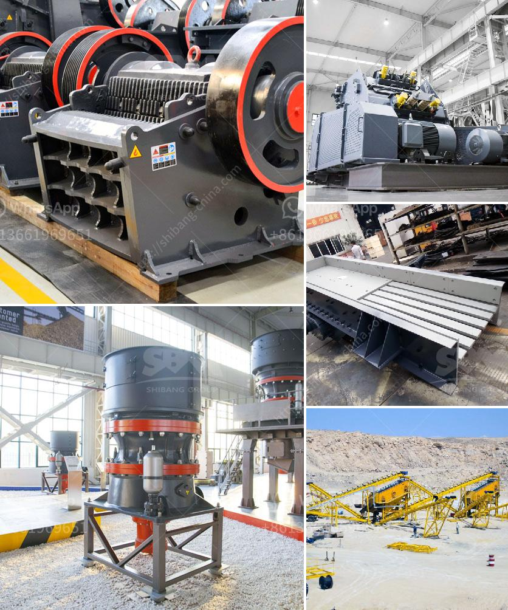

<h3>production grinding mill europe</h3>
Production grinding mills in Europe play a vital role in various industries - from manufacturing to agriculture. These mills are designed to process different materials into smaller particles or powders for easier handling and usage. With advanced technology and high-quality construction, production grinding mills in Europe provide efficient and reliable grinding solutions.

One of the key advantages of production grinding mills in Europe is their versatility. These mills can be used to grind a wide range of materials, including minerals, chemicals, food products, and even plastics. The ability to handle different materials makes these mills ideal for a variety of industries, such as mining, pharmaceuticals, and agriculture.

In terms of performance, production grinding mills in Europe excel in delivering consistent and precise results. These mills are equipped with robust grinding mechanisms that ensure uniform grinding and particle size reduction. The precision allows for accurate control over the final product, resulting in higher-quality outputs.

Moreover, production grinding mills in Europe are known for their durability and long service life. These mills are designed with heavy-duty materials and components, ensuring reliable performance even under demanding conditions. The robust construction enables them to withstand the high stress and constant grinding required in industrial applications.

Additionally, production grinding mills in Europe are equipped with advanced automation and control systems. These systems help optimize grinding processes, minimize downtime, and enhance productivity. With automated features, operators can easily adjust grinding parameters and monitor the mill's performance, ensuring efficient operation.

In conclusion, production grinding mills in Europe are essential equipment for various industries. Their versatility, performance, durability, and automation features make them valuable assets in grinding processes. Whether it's for mining, food production, or chemical manufacturing, these mills provide efficient and consistent grinding solutions, contributing to the overall success of the industry.
<h3>Contact us</h3><ul><li><strong>Whatsapp:&nbsp;<a href="https://wa.me/8613661969651">+8613661969651</a></strong></li><li><a href="https://swt.shibang-china.com/?git&amp;zhl&amp;production grinding mill europe"><strong>Online Service(chat now)</strong></a></li></ul><h3>Related</h3><ul><li><a href='gypsum processing crusher.md'>gypsum processing crusher</a></li><li><a href='coal powder mill.md'>coal powder mill</a></li><li><a href='gypsum factory in ethiopia.md'>gypsum factory in ethiopia</a></li><li><a href='beneficios de una chancadora conica.md'>beneficios de una chancadora conica</a></li><li><a href='coal processing plants south africa.md'>coal processing plants south africa</a></li></ul>