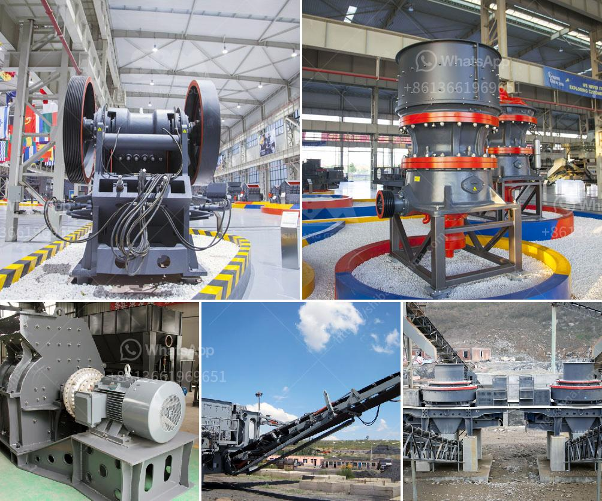

<h3>production line to produce calcium carbonate</h3>
The production line to produce calcium carbonate is an essential process in various industries. Calcium carbonate, also known as CaCO3, is a versatile compound that is widely used in various applications, including paper, plastics, paints, and adhesives. Its high demand and diverse applications have necessitated the setup of efficient production lines to meet the growing consumer needs.

The production line primarily involves the extraction and processing of limestone, which is the raw material used to produce calcium carbonate. Limestone is a sedimentary rock composed primarily of calcium carbonate, along with small amounts of other minerals. It is typically found in limestone quarries, where the rock is extracted through blasting or drilling.

Once the limestone is extracted, it undergoes various processes to transform it into calcium carbonate. The first step is crushing the raw material into small fragments, which are then further ground into fine particles. This grinding process is crucial as it increases the surface area of the limestone particles, enhancing the reaction kinetics and resulting in a higher quality calcium carbonate product.

After grinding, the limestone is subjected to a purification process known as beneficiation. The purpose of this process is to remove impurities present in the raw material, such as silica, clay, and iron oxides. These impurities can affect the quality and performance of the final calcium carbonate product. Beneficiation methods include washing, magnetic separation, and flotation, among others.

Once the limestone is purified, it is then subjected to a calcination process. Calcination involves heating the limestone at high temperatures (around 900-1000 degrees Celsius) to produce lime (CaO) and release carbon dioxide (CO2). This reaction is known as thermal decomposition and is essential for the production of calcium carbonate. The produced lime is then combined with water to form calcium hydroxide [Ca(OH)2], which, through a hydration process, is converted into calcium carbonate.

The obtained calcium carbonate is then dried and classified into different particle sizes according to customer specifications. This process involves passing the product through screens and air classifiers to separate it into different grades, ranging from fine powder to coarse granules.

The final step of the production line is packaging and storage. The calcium carbonate product is usually packed in bags or bulk containers, depending on the customer's requirements. It is then stored in warehouses or silos, ensuring its quality and preventing any potential contamination.

In conclusion, the production line for calcium carbonate plays a vital role in various industries. By employing efficient extraction, grinding, purification, and classification processes, it is possible to produce high-quality calcium carbonate products that meet the diverse needs of customers. As the demand for calcium carbonate continues to grow, the optimization of production lines becomes essential to ensure a stable supply and to meet the ever-increasing consumer demands.
<h3>Contact us</h3><ul><li><strong>Whatsapp:&nbsp;<a href="https://wa.me/8613661969651">+8613661969651</a></strong></li><li><a href="https://swt.shibang-china.com/?git&amp;zhl&amp;production line to produce calcium carbonate"><strong>Online Service(chat now)</strong></a></li></ul><h3>Related</h3><ul><li><a href='stone crusher machine for sale in kenya.md'>stone crusher machine for sale in kenya</a></li><li><a href='portable diamond processing plant supplier.md'>portable diamond processing plant supplier</a></li><li><a href='open cast mining equipment for sale south africa.md'>open cast mining equipment for sale south africa</a></li><li><a href='companies selling mining equipment in dubai.md'>companies selling mining equipment in dubai</a></li><li><a href='list of compartment of gypsum crusher plant.md'>list of compartment of gypsum crusher plant</a></li></ul>