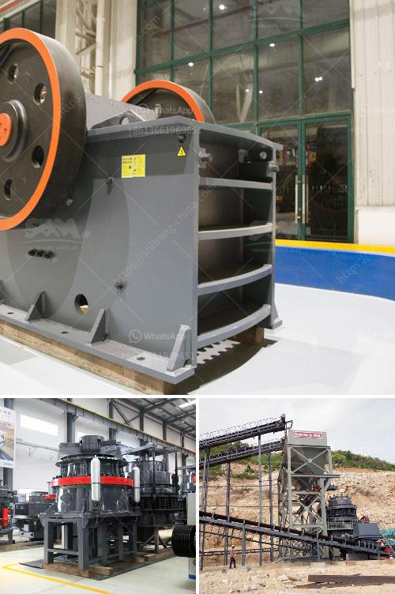

<h3>production of iron ore and manganese</h3>
Iron ore and manganese are two important minerals that are widely used in various industries. The production of these minerals plays a crucial role in the economic development of countries all around the world. In this article, we will explore the production of iron ore and manganese, the top producers globally, and their significance in different sectors.

Iron ore, one of the most abundant minerals on Earth, is primarily used to produce steel. Steel is the backbone of modern infrastructure, from buildings and bridges to machinery and vehicles. The production of iron ore involves extracting iron-rich rocks from the earth's crust. The process starts with open-pit or underground mining, where blast holes are drilled into the rock to access the iron ore. Once the ore is extracted, it is transported to processing plants where it is crushed, ground, and separated from impurities through various techniques, such as magnetic separation and froth flotation.

The top three producers of iron ore globally are Australia, Brazil, and China. Australia, known for its vast mineral resources, is the world's largest exporter of iron ore. The country's major iron ore deposits are located in the Pilbara region of Western Australia. Brazil, another significant player in the iron ore market, has rich reserves situated in the Carajás Mountains. China, on the other hand, is the largest consumer of iron ore, primarily due to its burgeoning steel industry.

Manganese, on the other hand, is an essential mineral used primarily in steel production and battery manufacturing. It imparts toughness, hardness, and anti-corrosive properties to steel, making it ideal for construction purposes. Manganese ores are typically found in close association with iron ores. The production process for manganese is similar to that of iron ore. After extraction, the ore undergoes various processing stages, including crushing, washing, and magnetic separation, to remove impurities and concentrate the desired manganese content.

South Africa is the largest producer of manganese globally, accounting for approximately 33% of the world's total production. The country's rich manganese deposits are mainly located in the Northern Cape Province. Other significant manganese producers include Australia, China, and Gabon. Australia's Groote Eylandt mine is renowned for its high-quality manganese ore, while China's production is primarily driven by its steel industry's demand.

The mining and production of iron ore and manganese have substantial economic and social impacts on communities and countries. In addition to providing income and employment opportunities, these minerals contribute to government revenues through taxes and royalties. However, it is important to balance the benefits of mining with environmental conservation and sustainable practices.

To ensure sustainable production, mining companies need to implement responsible mining techniques, minimize environmental impact, and prioritize the safety and well-being of their workers. Efforts should also be made to promote local content and value addition, encouraging the development of downstream industries that utilize iron ore and manganese.

In conclusion, the production of iron ore and manganese is vital for various industries, especially steel manufacturing. Australia, Brazil, and China are the top producers of iron ore, while South Africa dominates the manganese market. The sustainable and responsible production of these minerals is crucial for economic growth and development while minimizing environmental impact. Encouraging value addition and promoting local content is essential to maximize the benefits of these valuable resources.
<h3>Contact us</h3><ul><li><strong>Whatsapp:&nbsp;<a href="https://wa.me/8613661969651">+8613661969651</a></strong></li><li><a href="https://swt.shibang-china.com/?git&amp;zhl&amp;production of iron ore and manganese"><strong>Online Service(chat now)</strong></a></li></ul><h3>Related</h3><ul><li><a href='iron ore processing pdf.md'>iron ore processing pdf</a></li><li><a href='ball mill machine india.md'>ball mill machine india</a></li><li><a href='ball grinder machine.md'>ball grinder machine</a></li><li><a href='calcium carbonate plant sell in india.md'>calcium carbonate plant sell in india</a></li><li><a href='egypt gypsum powder manufacturer.md'>egypt gypsum powder manufacturer</a></li></ul>