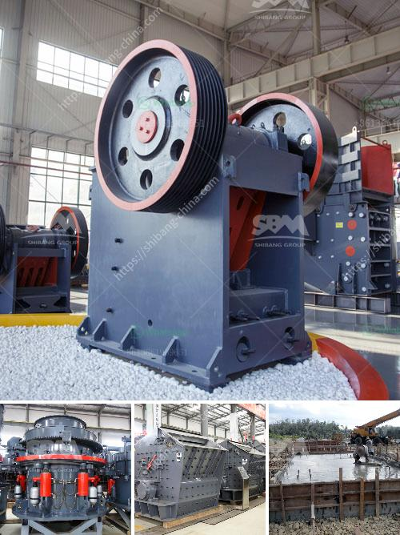

<h3>products mobile cone crusher</h3>
Mobile cone crushers are innovative machines that are designed to crush rocks and ores efficiently and effectively. In recent years, these crushers have become a popular choice for many mining and construction companies due to their flexibility and ease of operation.

One of the key features of mobile cone crushers is their ability to be moved around in a variety of configurations. This flexibility is advantageous for companies that need to transport the crushers to different sites for various projects. Additionally, mobile cone crushers are equipped with tracks or wheels, which further enhances their mobility and capability to navigate through different terrains.

Another advantage of mobile cone crushers is their compact design, which allows them to be easily transported and installed even in remote areas. This is particularly useful for companies operating in areas with limited infrastructure, as the crushers can be set up quickly and efficiently.

Mobile cone crushers are equipped with powerful crushing capabilities, enabling them to process even the toughest of materials. Whether it's hard and abrasive rock or recycled materials, these crushers are designed to deliver high-quality crushed products.

Furthermore, mobile cone crushers are equipped with advanced technology and features such as adjustable settings, automatic tramp release, and hydraulic load sensing. These features ensure that the crushers operate optimally, resulting in consistent product quality and reduced downtime.

In summary, mobile cone crushers are versatile machines that offer several advantages for mining and construction companies. Their mobility, compactness, and powerful crushing capabilities make them an ideal choice for companies that require flexibility and efficiency in their operations. With advanced features and technology, these crushers are able to deliver high-quality crushed products consistently.
<h3>Contact us</h3><ul><li><strong>Whatsapp:&nbsp;<a href="https://wa.me/8613661969651">+8613661969651</a></strong></li><li><a href="https://swt.shibang-china.com/?git&amp;zhl&amp;products mobile cone crusher"><strong>Online Service(chat now)</strong></a></li></ul><h3>Related</h3><ul><li><a href='belt and conveyor distributor in indonesia.md'>belt and conveyor distributor in indonesia</a></li><li><a href='hammer mill aluminum slag.md'>hammer mill aluminum slag</a></li><li><a href='25kg h high capacity grinder hammer milling machine.md'>25kg h high capacity grinder hammer milling machine</a></li><li><a href='mineral ball mill.md'>mineral ball mill</a></li><li><a href='open cast mining equipment for sale south africa.md'>open cast mining equipment for sale south africa</a></li></ul>