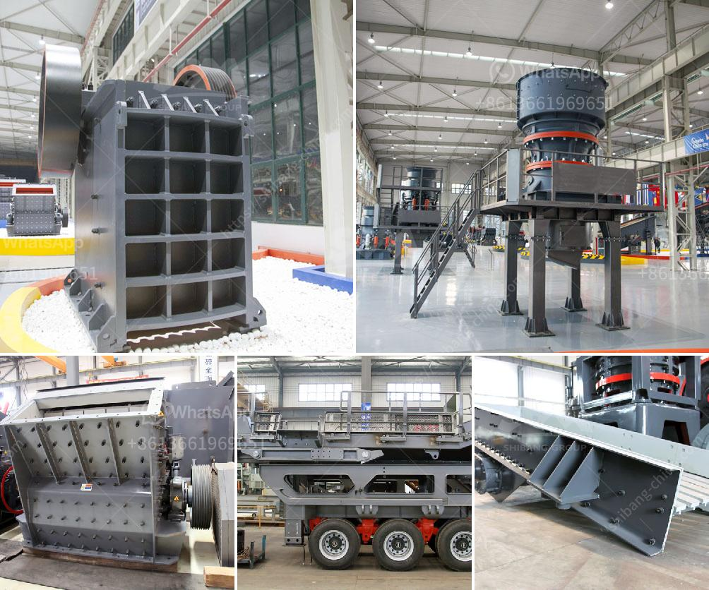

<h3>products of formulation for two roll mill</h3>
Two roll mills play a crucial role in the formulation process of various products in the manufacturing industry. These mills are widely used for mixing, dispersing, refining, and homogenizing various materials to achieve the desired product consistency and properties.

One of the primary applications of two roll mills is in the rubber industry. Natural rubber or synthetic rubber compounds are fed into the mill, which consists of two counter-rotating rolls. The rolls are coated with a heat and wear-resistant material, typically chrome-plated steel, to withstand the high temperatures and vigorous mixing forces.

During the mixing process, the rolls rotate at different speeds, causing the rubber mass to be subjected to intense shearing and compressive forces. This action allows for uniform distribution of ingredients, such as fillers, additives, and curing agents, throughout the rubber compound. The two roll mills help to break down any agglomerates and ensure a homogeneous mixture.

Beyond the rubber industry, two roll mills also find applications in other sectors such as plastics, adhesives, and pharmaceuticals. In plastics manufacturing, these mills are used for blending polymer resins with additives, colorants, and fillers. They help in achieving consistent melt viscosity, color dispersion, and uniform distribution of additives.

In the adhesives industry, two roll mills are utilized for creating adhesive formulations by mixing resins, solvents, fillers, and other additives. The mills help in achieving the desired consistency, adhesive strength, and curing properties of the final adhesive product.

Similarly, the pharmaceutical industry relies on two roll mills for the formulation of ointments, creams, and gels. The mills facilitate the dispersion of active pharmaceutical ingredients (APIs) within a suitable base, ensuring uniformity and improved drug release profiles.

In conclusion, two roll mills are multifunctional machines that are essential in the formulation process of various products across different industries. Their ability to efficiently mix, disperse, and refine materials makes them indispensable tools for achieving consistent and high-quality products.
<h3>Contact us</h3><ul><li><strong>Whatsapp:&nbsp;<a href="https://wa.me/8613661969651">+8613661969651</a></strong></li><li><a href="https://swt.shibang-china.com/?git&amp;zhl&amp;products of formulation for two roll mill"><strong>Online Service(chat now)</strong></a></li></ul><h3>Related</h3><ul><li><a href='impact rock crusher.md'>impact rock crusher</a></li><li><a href='kaolin industry machine dhaka bangladesh.md'>kaolin industry machine dhaka bangladesh</a></li><li><a href='stone crushing plant supplier south africa.md'>stone crushing plant supplier south africa</a></li><li><a href='ball mill problems and solutions.md'>ball mill problems and solutions</a></li><li><a href='granite quarry crusher equipment.md'>granite quarry crusher equipment</a></li></ul>