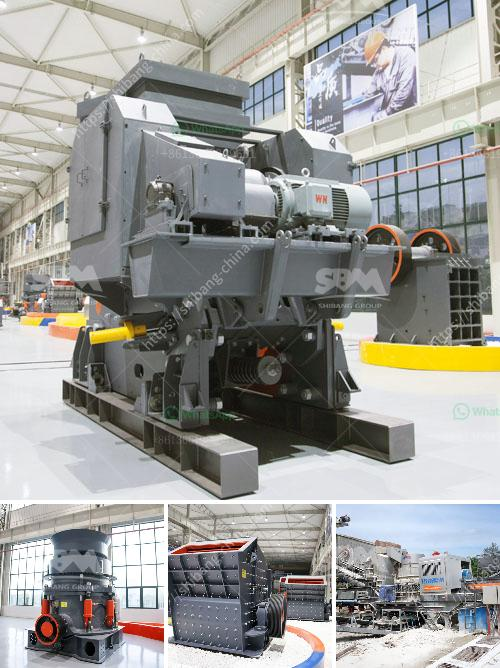

<h3>produk china grinding ball mill</h3>
China has emerged as a global manufacturing hub, catering to diverse needs of industries across the world. One of its many contributions to the manufacturing sector is the China grinding ball mill. This product has become a game-changer as it offers several advantages to industries, aiding in enhancing productivity and efficiency.

The China grinding ball mill is a type of grinder used to grind and blend materials for use in mineral dressing processes, paints, pyrotechnics, ceramics, and selective laser sintering. It works on the principles of impact and attrition: the size reduction is done by impact as the balls drop from near the top of the shell. A ball mill consists of a hollow cylindrical shell rotating about its axis. The axis of the shell may be either horizontal or at a small angle to the horizontal. It is partially filled with balls. The grinding media are the balls, which may be made of steel, stainless steel, ceramic, or rubber.

One of the key advantages of the China grinding ball mill is its versatility. It can be used for both wet and dry grinding, improving the efficiency and productivity of manufacturing processes. Wet grinding allows the material to be ground into fine particles as slurry, while dry grinding is more suitable for materials that tend to agglomerate or cake. Thus, the China grinding ball mill enables industries to utilize a wider range of materials and achieve finer particle sizes.

The China grinding ball mill also offers high operational reliability due to its low maintenance needs. It requires minimal attention during operation, which reduces the time and effort spent on maintenance activities. This allows industries to focus on their core operations, leading to better overall productivity.

Another advantage of the China grinding ball mill is its energy efficiency. It is designed to minimize energy consumption while maximizing the grinding efficiency. This not only reduces operational costs but also contributes to environmental sustainability. By utilizing the China grinding ball mill, industries can achieve significant energy savings, making their operations more eco-friendly.

Furthermore, the China grinding ball mill is known for its high grinding capacity. It can process large quantities of materials in a single batch, allowing for continuous production. This is particularly beneficial for industries that require high-volume processing, such as cement, mining, and pharmaceutical industries. The China grinding ball mill enables them to meet their production targets efficiently and effectively.

In conclusion, the China grinding ball mill is a versatile and efficient tool for enhancing the productivity of industries. With its ability to grind both wet and dry materials, low maintenance needs, energy efficiency, and high grinding capacity, it has become an essential equipment for numerous manufacturing processes. Moreover, by reducing operational costs and minimizing energy consumption, it contributes to environmental sustainability. Thus, the China grinding ball mill is a valuable asset for industries across the world, empowering them to achieve higher productivity and efficiency.
<h3>Contact us</h3><ul><li><strong>Whatsapp:&nbsp;<a href="https://wa.me/8613661969651">+8613661969651</a></strong></li><li><a href="https://swt.shibang-china.com/?git&amp;zhl&amp;produk china grinding ball mill"><strong>Online Service(chat now)</strong></a></li></ul><h3>Related</h3><ul><li><a href='price of jaw crusher in zimbabwe.md'>price of jaw crusher in zimbabwe</a></li><li><a href='delhi ball mill ceramic lining.md'>delhi ball mill ceramic lining</a></li><li><a href='stone crushers sale south africa.md'>stone crushers sale south africa</a></li><li><a href='clay vibrating screen.md'>clay vibrating screen</a></li><li><a href='oman marble quarry companies.md'>oman marble quarry companies</a></li></ul>