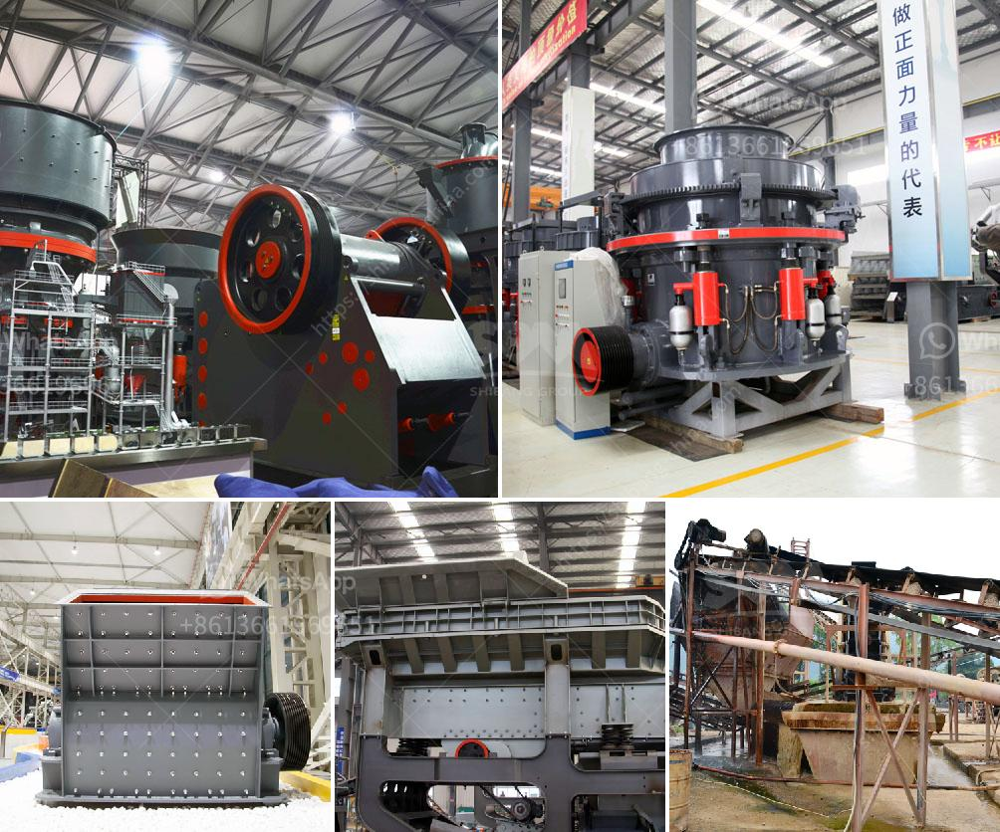

<h3>project plan about stone crashing machine</h3>
Stone crushing machines are used in a number of areas, such as construction materials, mining, metallurgy, forests, research and railroads, and it is used in a variety of industries, including medical and pharmaceutical, aerospace, automotive, semiconductor, electronics, and many more. With a growing demand for stone products, it is crucial to have efficient and reliable stone crushing machines to meet production requirements. This article presents a project plan for designing and developing a stone crushing machine.

The objective of this project is to design and develop a stone crashing machine that will increase productivity and reduce cost. The machine will be capable of crushing 200-300 tons of rock per hour and will allow operators to easily process stone on site. It will be designed to be transportable on a trailer and capable of operating in remote areas.

   - Develop a conceptual design of the stone crashing machine, considering factors such as size, weight, capacity, and mobility.

   - Identify and source suppliers for components and materials required for the construction of the machine.

   - Fabricate the machine's main components, such as the crushing chamber, motor, conveyor belts, and control panel.

Developing a stone crashing machine involves careful research, design, procurement, fabrication, and testing processes to ensure that the final product meets required specifications. The machine's efficiency, mobility, and capacity are all crucial factors to consider during the development process. With a well-executed project plan, the resulting stone crushing machine will be capable of meeting demand in a cost-effective and reliable manner, driving productivity in various industries.
<h3>Contact us</h3><ul><li><strong>Whatsapp:&nbsp;<a href="https://wa.me/8613661969651">+8613661969651</a></strong></li><li><a href="https://swt.shibang-china.com/?git&amp;zhl&amp;project plan about stone crashing machine"><strong>Online Service(chat now)</strong></a></li></ul><h3>Related</h3><ul><li><a href='mobile crushers zenith.md'>mobile crushers zenith</a></li><li><a href='secondary jaw crusher.md'>secondary jaw crusher</a></li><li><a href='tata stone crusher machines.md'>tata stone crusher machines</a></li><li><a href='limestone crusher plant price in india.md'>limestone crusher plant price in india</a></li><li><a href='business plan for aggregates production plant pdf.md'>business plan for aggregates production plant pdf</a></li></ul>