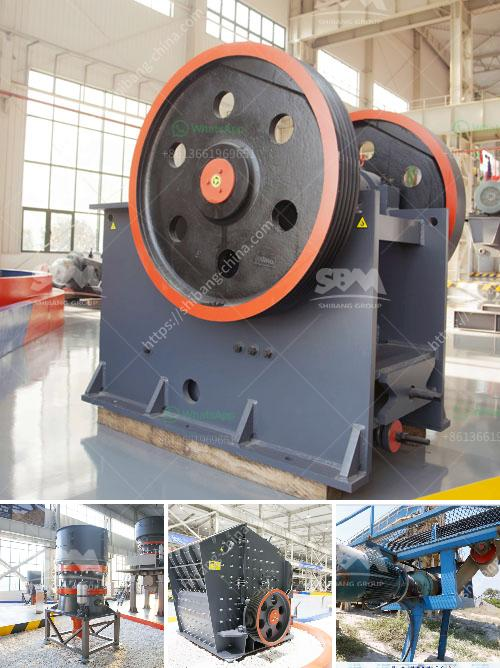

<h3>project proposal about grinding milling company</h3>
In today's fast-paced industries, the need for precision and efficiency has become paramount. With advancements in technology, the demand for specialized grinding and milling services has increased exponentially. This project proposal aims to establish a state-of-the-art grinding milling company that will contribute significantly to meeting this demand.

The primary objective of the proposed grinding milling company is to provide high-quality services that cater to various industries, such as automotive, aerospace, telecommunications, and more. By utilizing cutting-edge machinery and employing skilled professionals, the company will strive to achieve superior precision, productivity, and cost-effectiveness.

The grinding milling market is expanding rapidly due to the constant need for advanced components, intricate shapes, and tight tolerances. As manufacturing processes become more intricate, companies look for specialists capable of delivering high precision and accuracy. By capitalizing on this market demand, our proposed company is poised to succeed.

1. Precision Grinding: We will utilize state-of-the-art grinding machines to achieve high accuracy and tight tolerances. This service will be capable of grinding various materials, including steel, aluminum, copper, and alloys.

2. CNC Milling: Our company will invest in computer numerical control (CNC) milling machines to cater to complex machining requirements. The ability to perform multi-axis milling will enable us to produce intricate parts with utmost efficiency.

3. Surface Finishing: Apart from grinding and milling, we will also provide surface finishing services to ensure the aesthetic appeal and functional durability of the components. This includes polishing, deburring, and coating.

1. Cutting-edge Machinery: The proposed company will invest in advanced grinding and milling machines equipped with the latest technology, ensuring superior precision and speed.

2. Skilled Workforce: We will employ highly skilled technicians and engineers with extensive knowledge in grinding milling processes. By providing regular training and development programs, we will ensure that our workforce is up-to-date with the latest techniques and advancements.

3. Quality Assurance: Our company will implement stringent quality control measures throughout the manufacturing process to ensure that the final output meets or exceeds clients' expectations.

The establishment of a grinding milling company entails several costs, including machinery acquisition, facility setup, workforce recruitment, and marketing. A detailed financial analysis with budget allocation and projected ROI will be prepared.

The proposed timeline for the project includes obtaining necessary permits, procuring machinery, setting up the facility, training the workforce, and commencing operations. The timeline will be carefully planned to ensure efficient project execution.

The proposed grinding milling company aims to capitalize on the growing demand for high-precision machining services across industries. By offering advanced machinery, skilled professionals, and a commitment to excellence, the company will position itself for success. With the potential for high profitability and industry growth, this project proposal holds great promise for investors looking to venture into the grinding milling sector.
<h3>Contact us</h3><ul><li><strong>Whatsapp:&nbsp;<a href="https://wa.me/8613661969651">+8613661969651</a></strong></li><li><a href="https://swt.shibang-china.com/?git&amp;zhl&amp;project proposal about grinding milling company"><strong>Online Service(chat now)</strong></a></li></ul><h3>Related</h3><ul><li><a href='sand mills for manufacturing.md'>sand mills for manufacturing</a></li><li><a href='talc rock crusher.md'>talc rock crusher</a></li><li><a href='sand processing plant cost in russia.md'>sand processing plant cost in russia</a></li><li><a href='grinding ball mill equipment.md'>grinding ball mill equipment</a></li><li><a href='equipment necessary to exploiting a quarry.md'>equipment necessary to exploiting a quarry</a></li></ul>