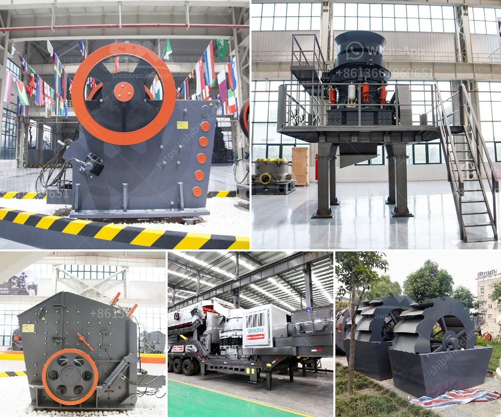

<h3>project proposal for gypsum manufacturing</h3>
Gypsum is a mineral widely used in various industries for its unique properties. It is a key component in the construction industry as it is used to make plaster of Paris, cement, and drywall. Given its high demand and limited supply, there is a potential opportunity to establish a gypsum manufacturing plant.

The objective of this project proposal is to set up a gypsum manufacturing plant that will produce high-quality gypsum boards for the construction industry. With a market size of over XX billion dollars annually, the demand for gypsum boards is expected to continue growing in the coming years.

The proposed manufacturing plant will utilize advanced technology and quality control measures to ensure the production of gypsum boards that meet international standards. The plant will have the capacity to produce XX million square meters of gypsum boards per year, making it a significant player in the market.

To ensure the project's success, a detailed market analysis will be conducted to identify key customers and competitors in the region. A comprehensive financial analysis will also be performed to assess the project's feasibility and profitability. Additionally, environmental impact assessments and regulatory compliance measures will be implemented to ensure sustainability.

The project will require a considerable investment in infrastructure, machinery, and human resources. However, with the right strategic partnerships and funding opportunities, this investment can be effectively managed. The project aims to generate employment opportunities and contribute to the economic growth of the region.

In conclusion, the establishment of a gypsum manufacturing plant presents a lucrative opportunity to meet the increasing demand for gypsum boards. By leveraging advanced technology, adhering to quality standards, and addressing environmental concerns, this project has the potential to become a leading player in the industry. With a comprehensive market analysis and financial feasibility study, this project proposal aims to attract investors and stakeholders to support the establishment of the gypsum manufacturing plant.
<h3>Contact us</h3><ul><li><strong>Whatsapp:&nbsp;<a href="https://wa.me/8613661969651">+8613661969651</a></strong></li><li><a href="https://swt.shibang-china.com/?git&amp;zhl&amp;project proposal for gypsum manufacturing"><strong>Online Service(chat now)</strong></a></li></ul><h3>Related</h3><ul><li><a href='lime powder production equipment.md'>lime powder production equipment</a></li><li><a href='mobile crusher sale.md'>mobile crusher sale</a></li><li><a href='crusher stone crusher 1 ton peru.md'>crusher stone crusher 1 ton peru</a></li><li><a href='standar operasional prosedur batubara mininh.md'>standar operasional prosedur batubara mininh</a></li><li><a href='maize grinding mill in philippines south africa.md'>maize grinding mill in philippines south africa</a></li></ul>