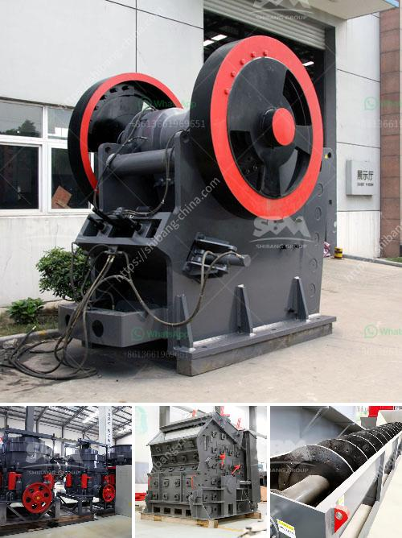

<h3>project proposal on funding gold mining</h3>
Gold mining has long been regarded as a lucrative business due to the high value and desirability of the metal. However, financing such ventures can be a significant challenge, especially for small-scale miners or mining startups. This project proposal aims to outline a funding plan for gold mining operations, highlighting its potential benefits and investment opportunities.

The main objective of this project proposal is to secure funding for gold mining operations, specifically targeting small-scale miners in need of financial assistance. By providing access to funds, this project seeks to support sustainable and responsible mining practices that maximize social, economic, and environmental benefits.

The funding proposed here will be organized in the form of investments in gold mining projects. Investors will provide capital in exchange for a stake in the mining operation, ensuring mutual benefits for all parties involved. This structure allows for shared risk, reward, and active participation in decision-making concerning the mining venture.

a. Economic Growth: The funding of gold mining projects helps stimulate local economies, creating job opportunities and increasing revenue streams. This has a positive effect on surrounding communities by improving their living standards and reducing poverty levels.

b. Resource Management: Funding projects that promote responsible mining practices ensures that resources are managed sustainably. Proper environmental impact assessments, waste management systems, and rehabilitation plans can be implemented, mitigating adverse effects on local ecosystems.

c. Socio-economic Development: By investing in gold mining projects, communities benefit from infrastructure development, such as roads, schools, hospitals, and access to clean water. These projects contribute to the overall socio-economic development of the region, thus improving the quality of life for local populations.

Investing in gold mining operations offers attractive long-term prospects for investors. The value of gold remains high, and demand continues to rise, making it a sound investment option. Moreover, returns on investment can be substantial, especially when supporting well-managed, ethical projects that prioritize sustainability.

Gold mining ventures come with inherent risks, including price volatility, political instability, and environmental challenges. However, these risks can be mitigated by conducting thorough due diligence, partnering with experienced mining operators, and implementing effective risk management strategies.

Environmental sustainability is a key concern in gold mining operations. To address this, the funded projects must adhere to strict environmental guidelines, utilizing modern technologies to minimize carbon emissions, water pollution, and deforestation. By promoting responsible mining practices, investors can contribute to preserving fragile ecosystems and promoting sustainable development.

Funding gold mining ventures can be a complex process, but it presents immense opportunities for investors and communities alike. By involving multiple stakeholders and following sustainable practices, this project proposal aims to secure funding that benefits all parties involved. The potential for economic growth, social development, and environmental sustainability within gold mining operations further underscores the importance of investing in responsible projects.
<h3>Contact us</h3><ul><li><strong>Whatsapp:&nbsp;<a href="https://wa.me/8613661969651">+8613661969651</a></strong></li><li><a href="https://swt.shibang-china.com/?git&amp;zhl&amp;project proposal on funding gold mining"><strong>Online Service(chat now)</strong></a></li></ul><h3>Related</h3><ul><li><a href='dental stone jaw crusher.md'>dental stone jaw crusher</a></li><li><a href='cost on vsi crusher.md'>cost on vsi crusher</a></li><li><a href='stone crushing machine prices za.md'>stone crushing machine prices za</a></li><li><a href='manganese ball milling machine.md'>manganese ball milling machine</a></li><li><a href='rock crusher gravel production.md'>rock crusher gravel production</a></li></ul>