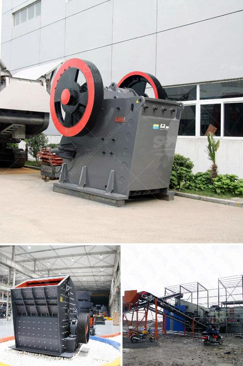

<h3>project report on stone crushing unit</h3>
Stone crushing industry is a significant industrial sector in the country engaged in producing crushed stone of various sizes depending upon the requirement which acts as raw material for various construction activities such as construction of roads, highways, bridges, buildings, canals etc. It is estimated that there are over 12,000 stone crusher units in India. The number is expected to grow further keeping in view the future plans for development of infrastructure of roads, canals and buildings that are required for overall development of the country.

In India, the Stone Crushing Industry sector is estimated to have an annual turnover of Rs. 5000 crore (equivalent to over US$ 1 billion) and is therefore an economically important sector. The sector is estimated to be providing direct employment to over 500,000 people engaged in various activities such as mining, crushing plant, transportation of mined stones and crushed products etc.

The Unit shall operate in shifts of maximum eight hours each and the total number of working days per week shall not exceed 6 (six).

The installed capacity of the unit is 150+50 = 200 tons per hour. The unit shall produce 600,000 tons of hard lime and basalt stone per year. Production of crushed stones of various sizes will be 42,000 tons per year.

The outflow of the plant will be 45,000 gallons per day. Total water requirement will be fulfilled from the nearby bore wells.

The plant would need power supply of 500kVA. The power requirement will be fulfilled from the nearby power grid.

The project is capable of producing 30,000 Cft of crushed stone at 100% capacity utilization with single shift of 8 hours per day. The stone crushing plant will be fed with rocks coming from rock quarries and nearby surroundings. Income from the stones goes for the family expenses, portion for fuel, maintenance, and salaries.

The gross margin and net margin rates are 60% and 30% respectively. The net sales revenue amounts to INR 72,000 (USD 1,500) while the capital employed of INR 19,580 (USD 400) meets already 98% of the capital requirement.

In conclusion, Stone Crushing Industry is a blooming one, creating thousand job opportunities for the local population. With an increased government focus on infrastructure development, the sector is poised for further growth. The project report on Stone Crushing Unit is a comprehensive document that covers all the necessary information and details to successfully set up a new stone crusher unit.
<h3>Contact us</h3><ul><li><strong>Whatsapp:&nbsp;<a href="https://wa.me/8613661969651">+8613661969651</a></strong></li><li><a href="https://swt.shibang-china.com/?git&amp;zhl&amp;project report on stone crushing unit"><strong>Online Service(chat now)</strong></a></li></ul><h3>Related</h3><ul><li><a href='komatsu crawler jaw crusher.md'>komatsu crawler jaw crusher</a></li><li><a href='hard rock crushers.md'>hard rock crushers</a></li><li><a href='harga jaw crusher 400x600.md'>harga jaw crusher 400x600</a></li><li><a href='quick lime powder making machine.md'>quick lime powder making machine</a></li><li><a href='quarry crushing equipments manufacturers.md'>quarry crushing equipments manufacturers</a></li></ul>