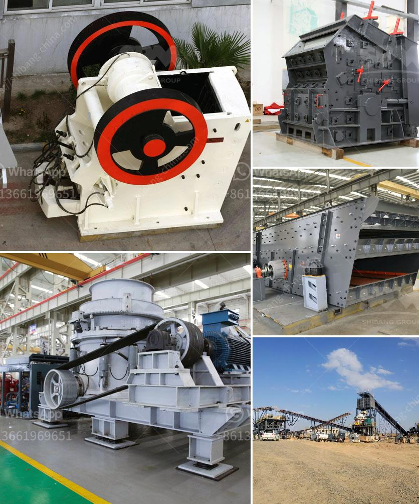

<h3>pulverizer for calcium carbonate</h3>
A pulverizer for calcium carbonate is a specialized device, primarily used for grinding and pulverizing a wide range of materials such as limestone, marble, kaolin, talc, barite, dolomite, calcite, gypsum, and many more. Calcium carbonate is a common substance found in rocks in all parts of the world, and its chemical formula is CaCO3. It is a versatile compound with diverse industrial applications, especially in the manufacturing of construction materials, paints, plastics, rubber, and pharmaceuticals.

The primary purpose of a pulverizer for calcium carbonate is to reduce the particle size of Calcium carbonate into fine powder, enabling easy mixing and blending. As a mineral resource, calcium carbonate is available in various forms, but its natural granular structure is not suitable for most applications. Therefore, it undergoes a pulverization process to break down the larger particles into smaller sizes that can be easily incorporated into different products.

One of the key advantages of using a pulverizer for calcium carbonate is its ability to produce a consistent and uniform particle size distribution. Unlike traditional milling methods, which can result in irregular particle sizes, a pulverizer ensures that the end product meets the required specifications. The consistent particle size leads to enhanced material performance and improved manufacturing efficiency.

In terms of operation, a pulverizer for calcium carbonate typically consists of a high-speed rotor assembly fitted with hammers or blades that impact and grind the feed material. The feed material enters the pulverizer through a central inlet and is continuously subjected to the processing force exerted by the rotating hammers or blades. The intense impact and grinding action reduce the feed material to the desired fineness.

Several factors need to be considered when selecting a pulverizer for calcium carbonate. These include the desired output fineness, the feed size of the material, the hardness of the material, and the required capacity. Manufacturers offer a variety of pulverizers with different sizes, designs, and capabilities to cater to the unique needs of various industries.

In conclusion, a pulverizer for calcium carbonate plays a vital role in the processing and manufacturing of various products. By efficiently reducing the particle size of calcium carbonate, it enables easier handling, blending, and incorporation into different applications. The use of a pulverizer ensures a consistent and uniform particle size, resulting in improved material performance and enhanced manufacturing efficiency. When selecting a pulverizer, it is important to consider factors such as desired fineness, feed size, material hardness, and capacity to ensure optimal performance and productivity.
<h3>Contact us</h3><ul><li><strong>Whatsapp:&nbsp;<a href="https://wa.me/8613661969651">+8613661969651</a></strong></li><li><a href="https://swt.shibang-china.com/?git&amp;zhl&amp;pulverizer for calcium carbonate"><strong>Online Service(chat now)</strong></a></li></ul><h3>Related</h3><ul><li><a href='gypsum deposit in indonesia.md'>gypsum deposit in indonesia</a></li><li><a href='mobile crushing stone machines from austria.md'>mobile crushing stone machines from austria</a></li><li><a href='crusher and mining equipments supplier from china.md'>crusher and mining equipments supplier from china</a></li><li><a href='fly ash grinding machine manufacturar in india.md'>fly ash grinding machine manufacturar in india</a></li><li><a href='roll mills supplier in karachi.md'>roll mills supplier in karachi</a></li></ul>