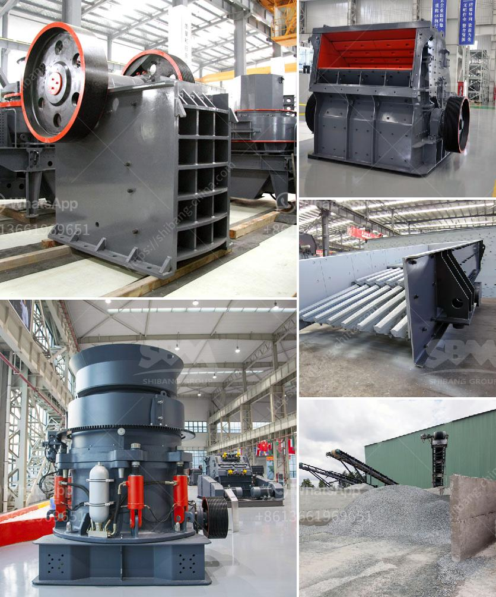

<h3>quarry aggregate crusher manufacturing process ppt</h3>
Quarry aggregate crusher manufacturing process ppt is a valuable resource for aggregate producers. The manufacturing process is a complex one that involves multiple steps and requires raw materials such as limestone, clay, and other minerals to be crushed into the necessary sizes. This process helps create a more robust and durable product that is essential for construction projects of all sizes.

The first step in the manufacturing process is the extraction of raw materials from the quarry. This involves drilling and blasting, which breaks apart the rock formations to access the valuable minerals. Heavy machinery such as drilling rigs and explosives are used to carry out this process in a controlled and safe manner.

Once the raw materials are extracted from the quarry, they are transported to the crushing plant. This is where the quarry aggregate crusher comes into play. The crusher reduces the size of the rocks by crushing and grinding them into smaller pieces. It uses mechanical force to break the rocks apart, resulting in the formation of aggregate materials of various sizes.

The quarry aggregate crusher consists of various types of crushers, including jaw crushers, impact crushers, and cone crushers. These different types of crushers have different characteristics and are used for different purposes. For example, jaw crushers are commonly used for primary crushing, while cone crushers are used for secondary and tertiary crushing.

After the rocks are crushed, they go through a series of screening processes. This is done to separate the aggregate materials into different sizes. Screening involves passing the crushed materials through a series of screens with different hole sizes. The screens allow the smaller aggregate materials to pass through while retaining the larger ones.

Once the aggregate materials are screened, they are stored in large stockpiles. These stockpiles are used for various purposes, such as blending different types of aggregates to create customized mixes for specific construction projects. The stockpiles also serve as a buffer supply to ensure a consistent and uninterrupted flow of materials for production.

The manufacturing process of quarry aggregate crushers also includes quality control measures. This ensures that the final product meets the required specifications and standards. Quality control involves regular testing of the aggregate materials for characteristics such as particle size distribution, moisture content, and flakiness index.

In conclusion, the quarry aggregate crusher manufacturing process is a crucial aspect of aggregate production. It involves the extraction of raw materials from the quarry, crushing and grinding of the rocks, screening and sorting of the resulting aggregate materials, and quality control measures to ensure the final product meets industry standards. This process plays a vital role in providing the construction industry with durable and reliable aggregate materials for various projects.
<h3>Contact us</h3><ul><li><strong>Whatsapp:&nbsp;<a href="https://wa.me/8613661969651">+8613661969651</a></strong></li><li><a href="https://swt.shibang-china.com/?git&amp;zhl&amp;quarry aggregate crusher manufacturing process ppt"><strong>Online Service(chat now)</strong></a></li></ul><h3>Related</h3><ul><li><a href='vertical shaft impact crusher design.md'>vertical shaft impact crusher design</a></li><li><a href='cement concrete crusher equipment.md'>cement concrete crusher equipment</a></li><li><a href='gold crusher for sale in turkey.md'>gold crusher for sale in turkey</a></li><li><a href='general hypothesis of jaw crusher.md'>general hypothesis of jaw crusher</a></li><li><a href='stone crushing turkey.md'>stone crushing turkey</a></li></ul>