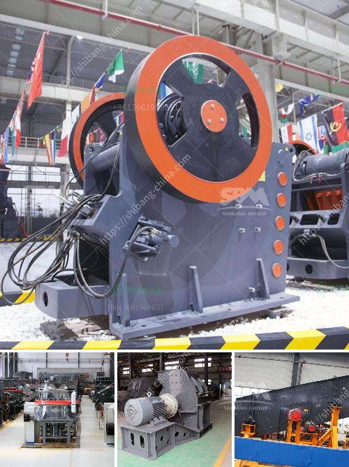

<h3>quarry aggregate manufacturing process ppt</h3>
Quarrying involves the extraction of valuable minerals or other geological materials from the earth’s surface. These materials are then used for construction purposes or other industries, such as manufacturing concrete, asphalt, and aggregate. The quarry aggregate manufacturing process plays a significant role in providing essential materials needed for infrastructure development and meeting the demands of the construction industry.

One widely used method of extracting quarry aggregate is through drilling and blasting. Before any extraction takes place, it is essential to conduct surveys and geological assessments to determine the quality and quantity of the desired materials. Once the site is identified, drilling is carried out to create holes in the earth's crust. These holes are strategically placed, following a predetermined pattern, ensuring the optimal extraction of quarry aggregates.

After drilling, explosives are inserted into the holes and detonated to break the rock into manageable pieces. The blasting process fractures the rock into smaller fragments, which can be transported more easily. This stage requires careful planning and execution to ensure safety and minimize environmental impact. Proper safety measures are essential to protect workers and nearby communities from any potential hazards associated with blasting.

Once the rock is fragmented, it is loaded onto trucks using heavy machinery, such as front-end loaders or excavators. These machines are used to transport the material to a processing plant, where additional steps are taken to manufacture the quarry aggregate.

At the processing plant, the rock is crushed into smaller sizes using crushers. Various types of crushers are used in this process, such as jaw crushers, impact crushers, and cone crushers, each capable of producing different sizes of aggregate. Crushing reduces the size of the rock and prepares it for further processing.

Next, the crushed rock is screened to separate the different sizes of aggregate. Screens with various mesh sizes are used to achieve the desired gradation. The separated aggregates are then stored in different compartments for further processing or direct use.

Washing is another important step in the manufacturing process, especially for sand and gravel aggregates. This process removes impurities, such as clay and silt, from the material, improving its quality and ensuring it meets the required specifications. Water is used to carry out the washing process, and the cleaned aggregate is then drained, dried, and stored.

The final step in the quarry aggregate manufacturing process is the storage and distribution of the finished products. The aggregates are stored in stockpiles based on their size and quality. Depending on the requirements of the customers, the aggregates can be transported by trucks, trains, or ships to construction sites or other locations.

The quarry aggregate manufacturing process is a well-regulated industry with strict standards and guidelines to ensure environmental sustainability and safety. Quarry operators comply with legal requirements and implement measures to mitigate the impact on the environment, such as proper water management, dust control, and land rehabilitation.

In conclusion, the quarry aggregate manufacturing process involves multiple stages, from extraction to production and distribution. It is a crucial industry that provides the necessary materials for construction projects, infrastructure development, and other industries. By following strict regulations and employing appropriate measures, quarry operators contribute to sustainable development while meeting the demands of the construction industry.
<h3>Contact us</h3><ul><li><strong>Whatsapp:&nbsp;<a href="https://wa.me/8613661969651">+8613661969651</a></strong></li><li><a href="https://swt.shibang-china.com/?git&amp;zhl&amp;quarry aggregate manufacturing process ppt"><strong>Online Service(chat now)</strong></a></li></ul><h3>Related</h3><ul><li><a href='crusher manufacturers in india.md'>crusher manufacturers in india</a></li><li><a href='concrete aggregate recycle machine.md'>concrete aggregate recycle machine</a></li><li><a href='how much investment needed to start a crusher in canada.md'>how much investment needed to start a crusher in canada</a></li><li><a href='ominer supplies namibia jaw crushers.md'>ominer supplies namibia jaw crushers</a></li><li><a href='stone crusher plants peru.md'>stone crusher plants peru</a></li></ul>