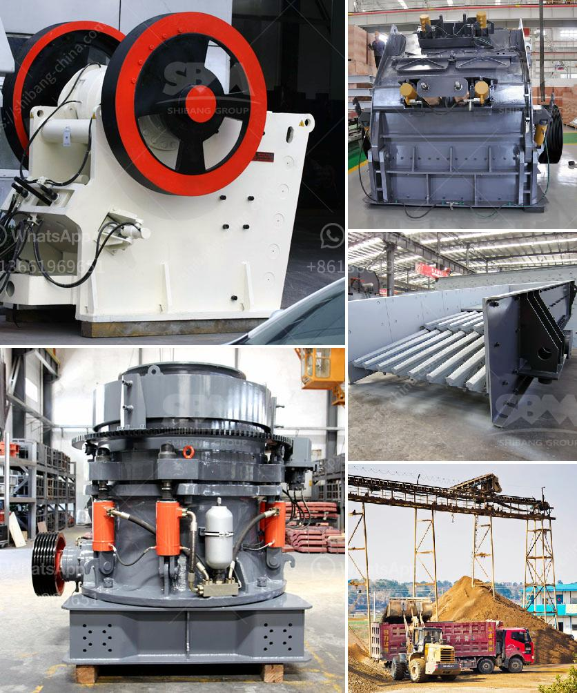

<h3>quarry crusher equipment manufacturer in germany</h3>
Germany is known for its engineering excellence, high-quality manufacturing standards, and innovative technology. The quarry crusher equipment manufacturer in Germany provides high-performance equipment for different Types of quarries. At the same time, Germany is one of the major importers of quarry products, making the country a pivotal player in the global quarrying industry.

Germany has a long history of quarrying that dates back to the Roman times. Over the years, mining and quarrying operations have become an integral part of the German economy. The country's diverse geological profile offers a wide range of valuable resources, such as limestone, dolomite, clay, sand, and gravel, which are used in various sectors, including construction, infrastructure development, and manufacturing.

German quarry crusher equipment manufacturers provide equipment that offers several key advantages, including:

1. High Efficiency: German manufacturers are known for producing high-quality machinery that provides excellent performance. Their quarry crusher equipment is designed to efficiently crush materials in various sizes. This enables quarry operators to produce more output with less energy consumption.

2. Durability: German manufacturers use robust materials and components to build their equipment. This ensures that the machinery can withstand harsh quarrying conditions and heavy-duty operations, resulting in longer service life and reduced maintenance costs.

3. Technological Advancements: German quarry crusher equipment manufacturers are at the forefront of technological advancements. They continually invest in research and development to improve the efficiency, safety, and environmental sustainability of their equipment. For example, many German manufacturers offer innovative features like automated settings, remote control operation, and advanced monitoring systems.

4. Environmental Friendliness: The German quarry crusher equipment manufacturers prioritize environmental sustainability. They strive to make their equipment as eco-friendly as possible by reducing noise levels, improving dust control measures, and implementing energy-saving technologies. This not only helps protect the environment but also improves the working conditions for quarry operators.

Several German manufacturers are renowned for their quarry crusher equipment. Some of the leading manufacturers include:

1. Kleemann GmbH: Kleemann is a subsidiary of the Wirtgen Group and specializes in mobile crushing and screening equipment. Their range of equipment includes jaw crushers, impact crushers, cone crushers, and screening plants.

2. Metso Minerals: Metso is a global supplier of quarry crusher equipment. Their product portfolio includes various types of crushers, screens, feeders, and conveyors. Metso's solutions are widely used in quarrying operations worldwide.

3. Sandvik Mining and Rock Technology: Sandvik offers a comprehensive range of quarry crusher equipment, including drilling rigs, tunneling equipment, crushers, screens, and conveyor systems. Their products are known for their reliability and high performance.

German quarry crusher equipment manufacturers have earned a reputation for producing high-quality, durable, and efficient equipment. Their technological advancements and commitment to environmental sustainability have helped them maintain a leading position in the global quarrying industry. Quarry operators can rely on German equipment to enhance their productivity, reduce costs, and comply with strict environmental regulations.
<h3>Contact us</h3><ul><li><strong>Whatsapp:&nbsp;<a href="https://wa.me/8613661969651">+8613661969651</a></strong></li><li><a href="https://swt.shibang-china.com/?git&amp;zhl&amp;quarry crusher equipment manufacturer in germany"><strong>Online Service(chat now)</strong></a></li></ul><h3>Related</h3><ul><li><a href='ball mill suppliers china.md'>ball mill suppliers china</a></li><li><a href='sand making plant supplier process crusher.md'>sand making plant supplier process crusher</a></li><li><a href='stone crusher machine price in bangladesh.md'>stone crusher machine price in bangladesh</a></li><li><a href='equipment necessary to exploiting a quarry.md'>equipment necessary to exploiting a quarry</a></li><li><a href='enquiry about cone crusher.md'>enquiry about cone crusher</a></li></ul>