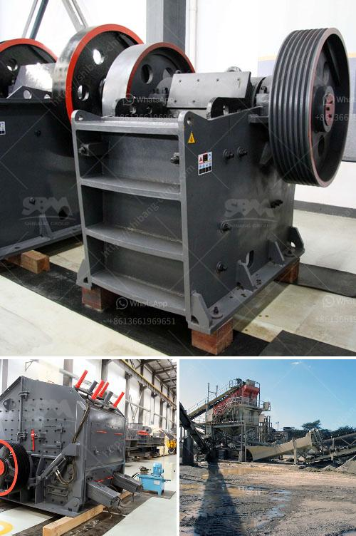

<h3>quarry crusher for sale in nigeria</h3>
Quarrying is a lucrative business in Nigeria, as it has found an extensive utilization in the construction industry. The quarry crusher is mainly used to crush the stones and rocks from the quarry site to make them into fine powder or gravel. It is ideal for crushing coal, limestone, and gypsum, as well as other medium-hard brittle materials.

Quarry crushers in Nigeria are available in stationary, portable, and mobile applications. They are suitable for all primary crushing needs from mining to contracting, and from extremely hard rock to recycling materials. The compact size and low weight of these crushers make it possible to install them into existing plants or onto new ones without any specific modifications.

One of the key benefits of the quarry crusher for sale in Nigeria is its versatility – with a wide range of optional equipment configurations. For each application, the technology is adapted to meet specific needs. This allows for high production efficiency and consistent end-product quality.

Depending on the requirements, the quarry crusher can be configured with jaw crusher, impact crusher, cone crusher, VSI crusher, vibrating screen, and belt conveyor, among others. These different types of crusher machines can be used in different mineral ore processing line.

In order to enhance the performance of the quarry crusher, A&C Machinery has introduced advanced technology from overseas, and designed a new type of crusher machine. It is equipped with high efficient hydraulic control system, with features such as high reduction ratio, high capacity, and excellent end-product shape.

Overall, quarry crushers for sale in Nigeria provide great convenience and bring significant benefits to the mining industry. Whether owned or leased, they are affordable and offer an opportunity for entrepreneurs to set up their own profitable quarrying business. With the right equipment and proper maintenance, these crushers can be a valuable addition to any construction project.
<h3>Contact us</h3><ul><li><strong>Whatsapp:&nbsp;<a href="https://wa.me/8613661969651">+8613661969651</a></strong></li><li><a href="https://swt.shibang-china.com/?git&amp;zhl&amp;quarry crusher for sale in nigeria"><strong>Online Service(chat now)</strong></a></li></ul><h3>Related</h3><ul><li><a href='copper ore mining for sale in philippines.md'>copper ore mining for sale in philippines</a></li><li><a href='how to separate gold from sand with machine.md'>how to separate gold from sand with machine</a></li><li><a href='crusher price in europe.md'>crusher price in europe</a></li><li><a href='100 tph hammer mill kenya.md'>100 tph hammer mill kenya</a></li><li><a href='aggregates crashing plant in nigeria.md'>aggregates crashing plant in nigeria</a></li></ul>