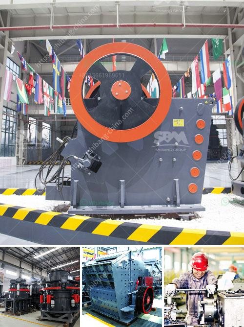

<h3>quarry crusher machine usa</h3>
The mining industry is a vital economic sector in the United States, contributing significantly to the nation's GDP and employment. Quarrying, an important branch of mining, involves the extraction of minerals, raw materials, and aggregates for various construction purposes. To achieve efficient and productive quarrying operations, advanced machinery and equipment play a crucial role. Among these machines, the quarry crusher machine stands out for its importance in the crushing process.

The quarry crusher machine is a specialized equipment specifically designed for the crushing of large-sized stones and rocks into smaller sizes. This powerful machine uses compressive force to break down the material into smaller pieces. Quarry crushing machines are used for processing various materials such as limestone, gravel, granite, and other minerals. Research and development in this field have led to the production of highly efficient and durable machines capable of handling heavy workloads.

One of the key advantages of using quarry crusher machines in the USA is the reduction in manual labor required for crushing operations. In the past, miners had to use hammers and other manual tools to break down rocks, a labor-intensive and time-consuming process. However, with the introduction of quarry crusher machines, the entire crushing process has become automated, reducing the need for manual labor. This not only increases efficiency but also enhances worker safety by minimizing the risk of accidents and injuries.

Another significant benefit of quarry crusher machines is their ability to produce a wide range of sizes and shapes of crushed materials. This versatility is invaluable in the construction industry, where different sizes of aggregates are required for various applications. For example, smaller crushed stones are used in road construction, while larger ones are used as building materials in the construction of houses and other structures. With quarry crusher machines, mining companies can produce different types of aggregates to meet the diverse needs of their customers.

Furthermore, quarry crusher machines are designed to operate efficiently even in challenging conditions. The rugged construction and high-quality materials used in their manufacturing ensure durability and longevity. These machines are equipped with advanced features such as hydraulic systems, feeders, and screens, which further enhance the efficiency and productivity of the crushing process. They are also designed to minimize downtime, reducing the overall operating costs for mining companies.

In conclusion, quarry crusher machines have revolutionized the mining industry in the United States. These machines have made the crushing process faster, safer, and more efficient, leading to increased productivity and profitability for mining companies. With their ability to produce a wide range of sizes and shapes of crushed materials, these machines have become indispensable in the construction industry. Moreover, their durability and efficiency make them ideal for use in challenging conditions, ensuring uninterrupted operations. As the mining industry continues to grow, the demand for quarry crusher machines in the USA is expected to rise, driving further innovation and technological advancements in this field.
<h3>Contact us</h3><ul><li><strong>Whatsapp:&nbsp;<a href="https://wa.me/8613661969651">+8613661969651</a></strong></li><li><a href="https://swt.shibang-china.com/?git&amp;zhl&amp;quarry crusher machine usa"><strong>Online Service(chat now)</strong></a></li></ul><h3>Related</h3><ul><li><a href='hydroton pebbles clay manufacturing process.md'>hydroton pebbles clay manufacturing process</a></li><li><a href='ball milling equipment and milling media.md'>ball milling equipment and milling media</a></li><li><a href='dolomite crushing machine mill.md'>dolomite crushing machine mill</a></li><li><a href='cone crusher supply.md'>cone crusher supply</a></li><li><a href='iron ore machine process.md'>iron ore machine process</a></li></ul>