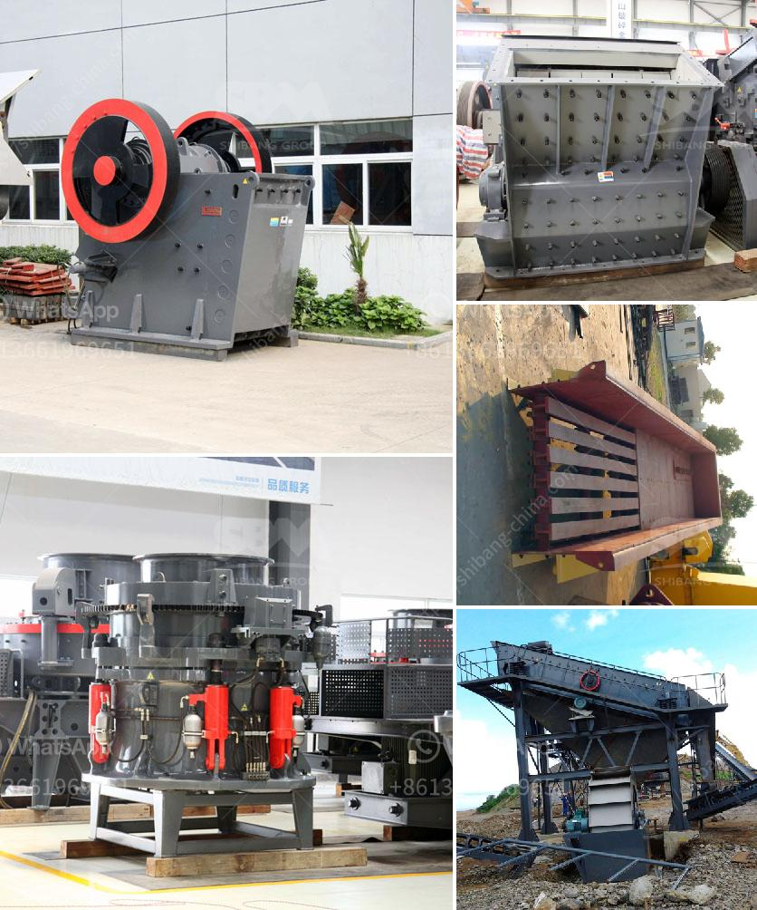

<h3>quarry crusher plant</h3>
Quarrying is the extraction of valuable minerals or other geological materials from the ground for various purposes. A quarry crusher plant is a type of mining operation that involves a significant amount of crushing and screening to produce the desired product.

Various types of rock such as granite, sandstone, and limestone can be processed. This operation involves drilling, blasting, and crushing the rock to a specific size. Specially designed machinery, known as crushers, are used for this purpose.

One of the key benefits of quarry crusher plant is its versatility and efficiency. It can be used for a wide range of applications, depending on the requirements. The plant can produce different sizes of aggregates, which are essential for construction projects. The materials produced can be used as road base, concrete aggregate, or even as fill material.

Moreover, the quarry crusher plant can also process limestone, which can be used as a raw material for various industries like cement, steel, and construction materials. This makes it a highly valuable resource that contributes to the economic growth of a region.

In addition, quarry crusher plants are environmentally friendly and emit less pollution compared to traditional mining methods. The use of modern machinery reduces dust and noise pollution, making it a safer and more sustainable operation.

Furthermore, quarrying operations can create job opportunities for the local community. The operation requires skilled workers, such as machine operators, mechanics, and engineers. This can stimulate the local economy and improve the quality of life for the residents.

Overall, quarry crusher plants play a crucial role in the mining industry. They provide the necessary materials for various construction projects, contribute to economic growth, and create job opportunities. Additionally, they are environmentally friendly and operate in a safe and sustainable manner.
<h3>Contact us</h3><ul><li><strong>Whatsapp:&nbsp;<a href="https://wa.me/8613661969651">+8613661969651</a></strong></li><li><a href="https://swt.shibang-china.com/?git&amp;zhl&amp;quarry crusher plant"><strong>Online Service(chat now)</strong></a></li></ul><h3>Related</h3><ul><li><a href='sand washing machine in sri lanka.md'>sand washing machine in sri lanka</a></li><li><a href='milling grinding machines manufacturer europe.md'>milling grinding machines manufacturer europe</a></li><li><a href='ball milling equipment and milling media.md'>ball milling equipment and milling media</a></li><li><a href='milling machine grinding mill.md'>milling machine grinding mill</a></li><li><a href='hammer mills factories.md'>hammer mills factories</a></li></ul>